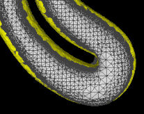

visfd
===========

## Volumetric Image toolkit for Simple Feature Detection

VISFD is a small C++ template library for 3D image processing
("[visfd.hpp](./lib/visfd/visfd.hpp)")
which is primarily used to extract geometric shapes, volumes, and other features
from 3-D volumetric images (tomograms).
VISFD also includes a basic C++ library for reading and writing MRC files.
("[mrc_simple.hpp](./lib/mrc_simple/mrc_simple.hpp)").

*VISFD's most useful feature is probably its ability to segment cell volumes
in Cryo-ET images, as well as closed membrane-bound compartments within cells.*

VISFD is also a collection of stand-alone programs
which use this library
(including "[filter_mrc](./doc/doc_filter_mrc.md)",
 "[combine_mrc](./doc/doc_combine_mrc.md)",
 "[voxelize_mesh](./doc/doc_voxelize_mesh.md)",
 "[sum_voxels](./doc/doc_sum_voxels.md)",
 and
 "[pval_mrc](./doc/doc_pval_mrc.md)").
They are documented [here](./doc).
Multiprocessor support is implemented using
[OpenMP.](https://en.wikipedia.org/wiki/OpenMP)

## *Alternatives to VISFD*
Much more comprehensive libraries and software tools are available for 3-D
image processing, such as [scikit-image](https://scikit-image.org) and
[scipy.ndimage](https://docs.scipy.org/doc/scipy/reference/ndimage.html).
*(MRC files can be read into python arrays using the
[mrcfile](https://mrcfile.readthedocs.io/en/latest/readme.html#basic-usage)
module.)*
In addition, sophisticated machine-learning methods have been implemented in
[EMAN2](https://blake.bcm.edu/emanwiki/EMAN2/Programs/tomoseg)
and
[scikit-learn](https://scikit-learn.org).
*VISFD compliments machine learning software*
by providing tools for geometry extraction,
[curve and surface detection](http://dx.doi.org/10.1016/j.jsb.2014.02.015),
robust connected-component analysis, and closing holes in incomplete surfaces.
For example, interesting features can be detected using programs
like EMAN2.  Then the coordinates of these geometric shapes can be
extracted using VISFD and analyzed using 3rd-party tools like
[**SSDRecon/PoissonRecon**](https://github.com/jewettaij/PoissonRecon)).
Using these tools together, it possible to automatically determine the
inside and outside of membrane-bound compartments in tomograms of cells.
*(This is a topological problen which existing machine learning strategies
have not yet been able to solve.)*

## programs included with this repository:

After compilation, all programs will be located in the "*bin/*" subdirectory.  Here is a brief description of some of them:

## filter_mrc

**[filter_mrc](./doc/doc_filter_mrc.md)**
is a stand-alone program which uses many of the
features of the **visfd** library.
This program was intended to be used for automatic
[detection](https://www.ncbi.nlm.nih.gov/pubmed/24625523)
and
[segmentation](./doc/doc_voxelize_mesh.md)
of
[closed](https://stackoverflow.com/questions/51149213/how-to-avoid-hole-filling-in-surface-reconstruction)
membrane-bound compartments in Cryo-EM tomograms.
Other features include
filtering,
annotation,
[scale-free blob-detection](https://en.wikipedia.org/wiki/Blob_detection),
[morphological noise removal](https://en.wikipedia.org/wiki/Opening_(morphology)),
[connected component analysis](https://en.wikipedia.org/wiki/Connected-component_labeling),
[filament (curve) detection *(planned)*](./doc/doc_filter_mrc.md#Detecting-curves), and
[edge detection *(planned)*](./doc/doc_filter_mrc.md#-edge-thickness).
Images can be segmented hierarchically into distinct contiguous objects,
using a variety of strategies.
This program currently only supports the *.MRC* (a.k.a. *.REC* or *.MAP*)
image file format.
As of 2021-9-13, this program does not have a graphical user interface.

Tutorials for using *filter_mrc* this are available
[**here**](https://github.com/jewettaij/visfd_tutorials).
A (long) reference manual for this program is available
[**here**](./doc/doc_filter_mrc.md).
The source code for the VISFD filters used by this program is located
[**here**](./lib/visfd/).

## voxelize_mesh.py
**voxelize_mesh.py** is a program that finds the voxels in a volumetric
image that lie within the interior of a closed surface mesh.
It was intended for segmenting the interiors of membrane-bound
compartments in tomograms of cells.
The mesh files that this program reads are *typically* generated by
*filter_mrc* ([together with other tools](./doc/doc_filter_mrc.md#example-3)).
However it can read any standard PLY file containing a closed polyhedral mesh.
This program currently only supports the .mrc/.rec image file format.
Documentation for this program is located
[here](./doc/doc_voxelize_mesh.md).
**WARNING: This experimental program is very slow and currently requires
a very large amount of RAM.**

## combine_mrc
**combine_mrc** is a program for combining two volumetric images (i.e. tomograms, both of identical size) into one image/tomogram, using a combination of addition, subtraction, multiplication, division, and thresholding operations.  These features can be used perform binary operations between two images (which are similar to "**and**", "**or**", and "**not**" operations.)
Documentation for this program is located
[here](./doc/doc_combine_mrc.md).

## histogram_mrc.py
**histogram_mrc.py** is a graphical python program which displays the
histogram of voxel intensities contained in an MRC file.
It can be useful when deciding what thresholds to use
with in the "**filter_mrc**" and "**combine_mrc**" programs.
Voxels and regions in the image can be excluded from consideration
by using the "-mask" and "-mask-select" arguments.
This software requires the *matplotlib* and *mrcfile* python modules
(both of which can be installed using pip).
Documentation for this program is located
[here](./doc/doc_histogram_mrc.md).

## sum_voxels
**sum_voxels** is a program for estimating volumes.
It is a simple program which
reads an MRC (.REC) file as an argument
and computes the sum of all the voxel intensities.
(Typically the voxel intensities are either 1 or 0.
 The resulting sums can be converted into volumes
 either by multiplying by the volume-per-voxel,
 or by specifying the voxel width using the "-w" argument,
 and including the "-volume" argument.)
For convenience, threshold operation can be applied
(using the "-thresh", "-thresh2", and "-thresh4" arguments)
so that the voxels intensities vary between 0 and 1
before the sum is calculated.
The sum can be restricted to certain regions
(by using the "-mask" and "-mask-select" arguments).
Documentation for this program is located
[here](./doc/doc_sum_voxels.md).

## pval_mrc
**pval_mrc** is a program for estimating the probability
that a cloud of points in an image is distributed randomly.
It looks for regions of high (or low) density in an image.
(The user can specify a *-mask* argument to perform the analysis
 in small, confined, irregularly-shaped subvolumes from a larger image.)
Documentation for this program is located
[here](./doc/doc_pval_mrc.md).

### Development Status: *alpha*

Program names, command line arguments, file names, and function names
(in the API) may change in the future.
Automated testing was added,
however as of 2020-12-15, some commits still (temporarily) break everything.
(...because I'm too lazy to use branch & merge.
 This usually gets fixed within 24 hours.
 If the build is failing, choose a previous commit.)

### Development Timeline

The most important features of this software are tested and working.
We hope to submit a paper on this software in late 2021 or early 2022.

## Installation

The [INSTALL.md](INSTALL.md) file has instructions
for installing VISFD and its dependencies.

## Requirements

- **16GB** of RAM or higher.
(For membrane detection, your RAM must exceed 11x-44x the size of the tomogram
 that you are analyzing.  This does not include the memory needed by the OS,
 browser, or other programs you are running.
 The *voxelize_mesh.py* program requires even more memory.
 You can reduce the memory needed and computation time dramatically
 by cropping or binning your tomogram.)
- A terminal (running BASH) where you can enter commands.
- A [C++ compiler](./INSTALL.md#Compile-the-VISFD-code)
- [make](https://en.wikipedia.org/wiki/Make_(software))
- Software to visualize MRC/REC/MAP files
(such as [IMOD/3dmod](https://bio3d.colorado.edu/imod/))
- python (version 3.0 or later)
- The "numpy", "matplotlib", "mrcfile", and "pyvista" python modules
  (These are are installable via "pip3" or "pip".)
- [**SSDRecon/PoissonRecon**](https://github.com/jewettaij/PoissonRecon).
- Software to visualize mesh files (such as [meshlab](http://www.meshlab.net)).

### Recommended:

- A text editor.  (Such as vi, emacs, atom, VisualStudio, Notepad++, ...
  Apple's TextEdit can be used if you save the file as *plain text*.)
- A computer with *at least* 4 CPU cores (8 threads).
- 32GB of RAM (depending on image size, this still might not be enough)
- [ChimeraX](https://www.cgl.ucsf.edu/chimerax/) is useful for visualizing
  MRC files in 3-D and also includes simple graphical
  [volume editing capability](https://www.cgl.ucsf.edu/chimera/docs/ContributedSoftware/voleraser/voleraser.html).
- (Optional) A **hard drive**.  (An HDD, not an SSD.)  The "filter_mrc"
  program frequently creates many large temporary files which could wear down
  an SSD over time.  Old-fashioned magnetic hard drives (HDDs) are sufficiently
  fast and are supposedly able tolerate this kind of usage better than SSDs.
  If you only use this program occasionally, or only use it for a single
  project, then you probably don't need worry about this issue.

## License

All of the code in this repository
(except for code located in "lib/mrc_simple" and "lib/visfd/eigen_simple.hpp")
is available under the terms of the terms of the
MIT license.  (See "[LICENSE.md](./LICENSE.md)")

### Additional license dependencies

#### MPL-2.0 licensed code (eigen_simple)
The "lib/visfd/eigen3_simple.hpp" file contains code from
[Eigen](http://eigen.tuxfamily.org) which requires the 
[MPL-2.0 license](lib/eigen_simple/COPYING.MPL2).

#### GPLv2 licensed code (mrc_simple)
A small subset of the code in "lib/mrc_simple" was adapted from ***IMOD***.
The IMOD code uses the GPL license (version 2), which is more restrictive.
License details for the "mrc_simple" library can be found in the
[COPYRIGHT.txt](lib/mrc_simple/COPYRIGHT.txt)
file located in that directory.
*If you write your own code using the "visfd" library to analyze 3D images
(which you have loaded into memory by some other means),
then you can ignore this notice.*

## Funding

VISFD was funded by NIH grant R01GM120604.
