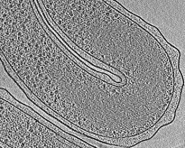
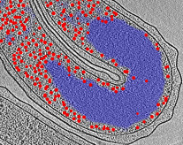

visfd
===========

## Volumetric Image toolkit for Simple Feature Detection

This is a C++ template library for 3D image processing
("[filter3d.hpp](./lib/filter/filter3d.hpp)")
as well as reading & writing image files using the the MRC file format
("[mrc_simple.hpp](./lib/mrc_simple/mrc_simple.hpp)").
It is also a collection of stand-alone programs 
which use this library
(including "[filter_mrc](./doc/doc_filter_mrc.md)", 
 "[combine_mrc](./doc/doc_combine_mrc.md)", 
 and
 "[pval_mrc](./doc/doc_pval_mrc.md)").
They are documented [here](./doc).
Multiprocessor support is implemented using
[OpenMP.](https://en.wikipedia.org/wiki/OpenMP)

## programs included with this repository:

After compilation, all programs will be located in the "*bin/*" subdirectory.  Here is a brief description of some of them:

## filter_mrc

  *<-- 2D slice through a segmented 3D tomogram:*

**filter_mrc** is a stand-alone program which uses many of the
features of the **visfd** library.
It was intended to be used for
[membrane (surface) detection](https://www.ncbi.nlm.nih.gov/pubmed/24625523),
filament (curve) detection (*available soon*),
and 
[scale-free blob-detection](https://en.wikipedia.org/wiki/Blob_detection), 
[watershed segmentation](https://imagej.net/Classic_Watershed)
with non-max suppression.
A list of detected objects can be sorted, clustered, and saved to a text file.

*(filter_mrc can also be used to apply simple filters to images, including
low-pass, high-pass,
thresholding,
brightness inversions,
fluctuations, 
[generalized Gaussian blur](https://en.wikipedia.org/wiki/Generalized_normal_distribution#Version_1),
[DoG](https://en.wikipedia.org/wiki/Difference_of_Gaussians),
[LoG](https://en.wikipedia.org/wiki/Blob_detection#The_Laplacian_of_Gaussian),
[Ridge-detection](https://en.wikipedia.org/wiki/Ridge_detection),
and 
[3D tensor voting](http://www.sci.utah.edu/~gerig/CS7960-S2010/handouts/Slides-tensorVoting-Zhe-Leng.pdf)
filters.)*

Documentation for this program is located
[here](./doc/doc_filter_mrc.md).
The source code for the filters used by this program
is located 
[here](./lib/filter/).
This program currently only supports the .mrc/.rec image file format.

## combine_mrc
**combine_mrc** is a program for combining two volumetric images (i.e. tomograms, both of identical size) into one image/tomogram, using a combination of addition, multiplication, and thresholding operations.  These features can be used perform binary operations between two images (which are similar to "**and**", "**or**", and "**not**" operations.)
Documentation for this program is located
[here](./doc/doc_combine_mrc.md).

## histogram_mrc.py
**histogram_mrc.py** is a graphical python program which displays the
histogram of voxel intensities contained in an MRC file.
It can be useful when deciding what thresholds to use
with in the "**filter_mrc**" and "**combine_mrc**" programs.
Voxels and regions in the image can be excluded from consideration 
by using the "-mask" and "-mask-select" arguments.
This software requires the *matplotlib* and *mrcfile* python modules
(both of which can be installed using pip).
Documentation for this program is located
[here](./doc/doc_histogram_mrc.md).

## sum_voxels
**sum_voxels** is a program for estimating volumes.
It is a simple program which
reads an MRC (.REC) file as an argument
and computes the sum of all the voxel intensities.
(Typically the voxel intensities are either 1 or 0.
 The resulting sums can be converted into volumes
 either by multiplying by the volume-per-voxel,
 or by specifying the voxel width using the "-w" argument,
 and including the "-volume" argument.)
For convenience, threshold operation can be applied
(using the "-thresh", "-thresh2", and "-thresh4" arguments)
so that the voxels intensities vary between 0 and 1
before the sum is calculated.
The sum can be restricted to certain regions
(by using the "-mask" and "-mask-select" arguments).
Documentation for this program is located
[here](./doc/doc_sum_voxels.md).

## pval_mrc
**pval_mrc** is a program for estimating the probability
that a cloud of points in an image is distributed randomly.
It looks for regions of high (or low) density in an image.
(The user can specify a *-mask* argument to perform the analysis
 in small, confined, irregularly-shaped subvolumes from a larger image.)
Documentation for this program is located
[here](./doc/doc_pval_mrc.md).

## Development Status: *alpha*
Program names, command line arguments, file names, and function names
(in the API) may all change in the future.

## Compilation

## Linux:

    cd src
    source setup_gcc_linux.sh
    make

(If you are not using the bash shell, enter "bash" into the terminal beforehand.)

## Windows:

   It is recommended that you install the BASH shell environment on your computer, along with *gcc* and *make*.  (If you decide to use a different compiler, modify the "setup_gcc_linux.sh" file accordingly.)  There are several ways to do that.

   Perhaps the easiest way is to install [virtualbox](https://www.virtualbox.org) in windows together with a linux distribution with a lightweight desktop, such as [xubuntu](https://xubuntu.org).  Alternatively, if you are using Windows 10 or later, you can try installing the "Windows Subsystem for Linux (WSL)", as explained
[here](https://solarianprogrammer.com/2017/04/15/install-wsl-windows-subsystem-for-linux/)
and
[here](https://msdn.microsoft.com/en-us/commandline/wsl/faq),
or
[Hyper-V](https://blogs.windows.com/buildingapps/2018/09/17/run-ubuntu-virtual-machines-made-even-easier-with-hyper-v-quick-create/).
Otherwise, if you are using an older version of windows, try installing
[CYGWIN](https://www.cygwin.com/) instead.

## Apple Mac:

    cd src
    source setup_gcc_mac_serial.sh
    make

NOTE: This will compile the (slow) serial version.
To take advantage of multicore processors, you will have to
[install support for OpenMP](https://stackoverflow.com/questions/29057437/compile-openmp-programs-with-gcc-compiler-on-os-x-yosemite)

*The following proceedure has not been tested:*

Apparently, one way to do this is to install homebrew, and then use:

    brew install gcc

Homebrew typically installs a version of g++ with an alternate name, such as
"g++-8" (for example).
You can either edit the "setup_gcc_mac_serial.sh"
file and replace "g++" with "g++-8" beforehand,
***...or*** 
add the following line:

    alias g++='g++-8'

... to your ~/.bashrc file (and open a new terminal).
Then use:

    cd src
    source setup_gcc_mac.sh
    make

Alternatively, if you prefer to avoid homebrew, it is possible to
[use OpenMP with the clang compiler.](https://iscinumpy.gitlab.io/post/omp-on-high-sierra/)
(You will need to modify the "setup_gcc_mac_serial.sh" file accordingly.
 One day, perhaps I will learn how to make this less painful.)

## Requirements:

The optional "draw_filter_1D.py" script
(included in the "bin/filter_mrc" directory)
requires python, numpy, and matplotlib.
(It is useful only if you actually want to see
 the shape of the convolution filter that is currently in use.
 Most users can ignore this.)

## License

These programs are available under the terms of the open-source 3-clause BSD
license.  (See "[LICENSE.md](./LICENSE.md)")
