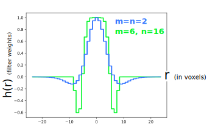

filter_mrc
===========

**filter_mrc** is typically used for detecting
1-D **curves** and 2-D **surfaces** in 3-D images
*(using [3D tensor voting](https://www.ncbi.nlm.nih.gov/pubmed/24625523))*.
It can also detect point-like (or sphere-like) **blobs**.
*(* **WARNING:** *The detection of curves is experimental as of 2021-6-21.)*

It can also be used local minima-finding, clustering, and
[classic watershed segmentation](https://imagej.net/Classic_Watershed).
The coordinates of the objects that are detected can be saved to
text files for processing and refinement using popular 3rd-party software tools
(including tools for surface smoothing and surface closure).
The *filter_mrc* program can also apply simple filters to an 3D image
(tomogram), and save the result as a new .mrc/.rec file.
Several primitive filters are included including
low-pass, high-pass,
thresholding,
brightness inversions,
[generalized](https://en.wikipedia.org/wiki/Generalized_normal_distribution#Version_1)
[Gaussian](https://en.wikipedia.org/wiki/Gaussian_blur),
[Difference-of-Gaussian](https://en.wikipedia.org/wiki/Difference_of_Gaussians),
[Laplacian-of-Gaussian](https://en.wikipedia.org/wiki/Blob_detection#The_Laplacian_of_Gaussian),
edge detectors,
and fluctuation (noise) detectors
are available

Lastly, the *filter_mrc* program can be used as a crude paint program
to modify, edit, or annotate existing volumetric images.

All filters support "masking".
An image *mask* can be used to exclude certain
voxels or regions from consideration.
(Typically these are voxels which have been characterized previously.
The contributions from remaining voxels are normalized, so that objects located
within narrow confined spaces can be detected accurately and without penalty.)
Masks can also be used to give some voxels more consideration
than others during the blurring (filtering) process.  (A.K.A. "weighting".)
You can use a mask to to apply a filter to an image
whose boundaries are smooth and gradual as opposed to jagged and rectangular,


## Usage Examples:

### Example 1
```
# Detect membranes in an EM image using tensor voting
# (target thickness ≈ 60.0 Angstroms)

filter_mrc -in tomogram.rec \
  -out membranes.rec \
  -surface minima 60.0 -best 0.06 \
  -tv 5.0 -tv-angle-exponent 4 \
  -bin 2 \
  -save-progress membranes
```

This searches for dark surfaces of thickness approximately 60 (Angstroms), and
creates a new image file ("membranes.rec") with the membranes emphasized.
View this file (eg. using IMOD) to see if the membranes are successfully
detected.  You may need to adjust this thickness parameter
(and the other parameters) until the membrane is clearly visible.
**This is extremely slow, so try this on a small, cropped image first.**
(In my experience, "60" is a reasonable default thickness parameter to
detect lipid bilayers, assuming the voxel widths are in units of Angstroms.
Incidentally, you can specify the physical width of each voxel using the
[-w argument](#Voxel-Width).)

Note: After the membrane features are detected, they must be analyzed.
This typically requires running the "filter_mrc" program multiple times.
The optional
["-save-progress"](#--save-progress-FILENAME-and--load-progress-FILENAME)
argument used here allows us to skip the time consuming process of
detecting the membrane each time we run "filter_mrc" later on.
(See [example 3](#Example-3) below.)

Note: The computation time will be roughly proportional to the image size
*as well as* the "-best" argument (which ranges from 0 to 1).
(See [example 3](#Example-3) below.)  The computation time also varies
dramatically with the voxel width.  High resolution images with many small
voxels are prohibitively slow to analyze.  So in this example, the user
included the optional [-bin 2](#--bin-binsize) argument, to reduce the image
resolution by a factor of 2.  If the thickness of the membrane you wish
to detect is multiple voxels wide, then using "-bin 2" or "-bin 3" should
hopefully not significantly affect the features you detect.


### Example 2

Detect all dark blobs ("minima") between 190 and 300 Angstroms in width.
This corresponds (approximately) to objects which are the size of ribosomes.

```
filter_mrc -in tomogram.rec \
  -blob minima tomogram_blobs.txt 190.0 300.0 1.01

# Now discard the faint, noisy, or overlapping blobs.

filter_mrc -discard-blobs tomogram_blobs.txt tomogram_ribosomes.txt \
  -minima-threshold -70 \
  -radial-separation 0.8 \
  -mask cytoplasmic_volume.mrc   # <- optional

# Finally, create an image showing the remaining blobs we want to keep:

filter_mrc -in tomogram.rec \
  -out tomogram_ribosomes.rec \
  -draw-hollow-spheres tomogram_ribosomes.txt
```

Note:
The ["*-mask cytoplasmic_volume.rec*"](#-mask-MRC_FILE)
argument used in the second step
is optional.
I use it in this example because we are searching for ribosomes,
so we want to restrict our search to blobs which lie *inside* the cell.


Note:
All of these parameters make reasonable
defaults for ribosome detection except the
["*-minima-thresold*"](#Automatic-disposal-of-poor-scoring-blobs)
parameter ("-70" in the example).
It must be chosen carefully because it will vary from image to image.
(Strategies for choosing this parameter are discussed
[below](#automatic-disposal-of-poor-scoring-blobs).
*Alternatively,* it can be determined automatically using the
["*-auto-thresh*"](#-auto-thresh-score--supervised-file_accepttxt-file_rejecttxt)
argument.


### Example 3

Find the **largest membrane** in an image,
and **generate a closed surface** for that membrane.
(This example requires
 [*PoissonRecon*](https://github.com/mkazhdan/PoissonRecon) and
 [*meshlab*](http://www.meshlab.net).)

This is a complicated example with several steps.
In order for this to work, you must make sure you are able to detect the
membrane first.  To do that, first try the procedure in [example 1](#Example-1)
on your tomogram.  Try that on a small cropped image.
View the newly created image, and if the membranes are clearly visible.
If so, then you are ready to try the example below.
(If not, adjust the -surface thickness parameter.)

```
filter_mrc -in tomogram.rec \
  -out membranes_clusters.rec \
  -surface minima 60.0 \
  -tv 5.0 -tv-angle-exponent 4 \
  -bin 2 \
  -load-progress membranes \
  -connect 1.0e+09 -connect-angle 45 \
  -select-cluster 1 -surface-normals-file largest_membrane_pointcloud.ply
```
Note:
Here I assumed that the user has already followed the instructions in
[example 1](#Example-1).  (Consequently, to save time, we used the
["-load-progress"](#--save-progress-FILENAME-and--load-progress-FILENAME)
to argument to skip over the time consuming
process of detecting the membrane again.)
This will generate a new file ("largest_membrane_pointcloud.ply")
containing a list of points located on the largest surface. You can use
[*PoissonRecon*](https://github.com/mkazhdan/PoissonRecon)
to load this file and close the holes in the surface:
```
PoissonRecon --in largest_membrane_pointcloud.ply \
  --out largest_membrane.ply --depth 12 --scale 2.0
```
The resulting *(hopefully)* closed surface (eg. "largest_membrane.ply")
can be visualized in [*meshlab*](http://www.meshlab.net), smoothed
(for example, by iteratively using
"Filters"->"Smoothing"->"HC Laplacian Smooth"),
and later voxelized using [voxelize_mesh.py](doc_voxelize_mesh.md):
```
voxelize_mesh.py -m largest_membrane.ply -i tomogram.rec -o segmented.rec
```
**(WARNING: [Use ulimit beforehand.](doc_voxelize_mesh.md)**)
This newly created image file (eg. "segmented.rec") is a segmented 3D image,
indicating which voxels belong to the interior of the closed surface.
(These voxels could correspond to a cell's cytoplasm
 or an organelle within the cell, for example.)
This new image can then be used as a mask for future
image processing, allowing you to segment the contents of the cell
or segment concentric compartments inside larger compartments
(eg. organelles inside cells).

Note:
All of these parameters make reasonably good
defaults for membrane detection except the
["**-connect**"](#-connect-threshold)
parameter ("1.0e+09" in the example).
It must be chosen carefully because it will vary from image to image.
Use the "-load-progress FILENAME" argument to save time
while experimenting with different thresholds.
Strategies for choosing this parameter are discussed
[below](#determining-the--connect-threshold-parameter).
If a suitable parameter can not be found, you can also use the
["**-must-link**"](#-must-link-FILE)
argument to manually force connections between
disconnected regions. (See below.)

Note:
If the resulting surface is *not closed*,
then try increasing the "--scale" parameter.


## WARNING: Use *ulimit*
Some operations, such as tensor-voting and voxelization, consume a large
amount of RAM.  Consequently, it is strongly recommended that you use the 
[ulimit -v SIZE_IN_KB](https://ss64.com/bash/ulimit.html)
command to prevent system lockup, especially if you are on a shared computer.
(If my understanding is correct, running "ulimit -v 14000000" beforehand
should prevent programs like filter_mrc from consuming more than 14Gb of RAM.)


## Arguments:

### Input and Output files

The user must specify the name of the tomogram they wish to process using the
"-in" argument:
```
   -in SOURCE_FILE.rec
```
(Note: **Files can end in ".mrc"** instead of ".rec".
 *Alternatively,* the user can start with a **blank image**
 by specifying the "**-image-size nx ny nz**" argument.
 This can be useful when you are using filter_mrc to
 calculate something that no longer needs to know what
 the original image looks like.)

Users must specify the name of the new tomogram
(created by applying the filter to the original tomogram)
using the "-out" argument:
```
   -out DESTINATION_FILE.rec
```


### Voxel Width

*By default, all of the parameters provided by the user
are assumed to be in **physical units**.  (Eg. *Angstroms*, not *voxels*.)
This makes it more convenient to apply the software
to images at different magnifications.
(This includes all of the width parameters used with the
 "-gauss", "-blob", "-dog", "-draw-spheres", and "-template-gauss" filters.)

Consequently, this program needs to know the physical width of each voxel.
By default it will attempt to infer that from the MRC file
*(which are typically stored in units of Angstroms, not nm)*.
If you have a more accurate estimate of the voxel width,
you can specify it using the "**-w**" argument:
```
   -w voxelwidth
```
The "-w" argument will override the voxel widths
specified in the MRC file.

Setting voxelwidth to 1 using "-w 1"
will allow you to enter distance parameters in units of voxels.

*(In the Jensen Lab tomography database, there is typically
 a ~10% difference between the voxel width stored in the
 MRC file, and the voxel width stored at the
 corresponding entry in the tomography database.
 The later is more accurate.)*


## A Short Description of Each Filter Type:

Again, this program is most frequently used for detecting
2-D **surfaces**, 1-D **curves**, and point-like **blobs** in images.


- The ["**-surface**"](#Detecting-membranes)
argument is used to detect thin, membrane-like structures using
[3D ridge detection](https://en.wikipedia.org/wiki/Ridge_detection)
- The ["**-edge**"](#--edge-thickness) argument is used to detect
surfaces at the edge of light-dark regions
*(<- WARNING: FEATURE NOT TESTED. 2021-6-21)*
- The ["**-curve**"](#Detecting-curves) argument is used to detect thin curves.
*(<- WARNING: FEATURE NOT TESTED. 2021-6-21)*.
The fidelity of these three detectors can be improved by using
a method known as [3D tensor voting](http://www.sci.utah.edu/~gerig/CS7960-S2010/handouts/Slides-tensorVoting-Zhe-Leng.pdf)
using the ["**-tv**"](#-tv-σ_ratio) argument.
Voxels belonging to individual surfaces or curves
can be grouped together using using the
["**-connect**"](#-connect-threshold) argument.
Voxels belonging to the same surface can be analyzed and their locations
and orientations can be saved to a file for further analysis using the
["**-surface-normals-file**"](#-surface-normals-file-PLY_FILE)
argument.
- The
["**-blob**"](#Blob-detection)
,
["**-blob-r**"](#Specifying-the-radius-or-Gaussian-sigma-parameters-for-the-objects-of-interest),
and
["**-blob-s**"](#Specifying-the-radius-or-Gaussian-sigma-parameters-for-the-objects-of-interest)
arguments can be used for
[scale-free blob detection](https://en.wikipedia.org/wiki/Blob_detection#The_Laplacian_of_Gaussian).
Objects in the image of various sizes can be detected using this filter.
Several strategies for
[Non-max suppression](#Non-max-suppression:-automatic-disposal-of-blobs)
are provided.

All of these detection algorithms can be quite slow.
Several strategies to reduce computation time are described below,
including cropping and [binning](#--bin-binwidth) your 3-D image (tomogram).


Other, simpler filters are also provided:


The
["**-gauss**"](#-gauss-and--ggauss)
filter applies a simple (low-pass)
[Gaussian blur](https://en.wikipedia.org/wiki/Gaussian_blur)
filter to your image.
(The
["**-gauss-aniso**"](#-gauss-and--ggauss)
filter allows you to apply different amounts of blurring to the X,Y, and Z directions.)
[Generalized Gaussians](https://en.wikipedia.org/wiki/Generalized_normal_distribution#Version_1) are supported.


The
["**-dog**""](#-dog)
filter uses a
[Difference-Of-Gaussians](https://en.wikipedia.org/wiki/Difference_of_Gaussians)
filter which can be used as a frequency band-pass filter (for high and/or low frequency removal).
(The
["**-dog-aniso**"](#-dog)
filter allows you to modify the properties of the filter in the X,Y,Z directions.  Filter sharpness can be customized using the
["-exponents"](#-dogg)
argument.)
[Generalized Gaussians](https://en.wikipedia.org/wiki/Generalized_normal_distribution#Version_1) are supported.


The
["**-watershed**"](#-watershed-type)
argument will generate a new image which has been
segmented using the
[classic watershed](https://imagej.net/Classic_Watershed)
algorithm.


The
["**-fluct**"](#-fluct-and--fluct-aniso)
and
["**-fluct-aniso**"](#-fluct-and--fluct-aniso)
filters calculate the magnitude of
the voxel intensity fluctuations relative to their local surroundings.
They can be used to find locations in the image where the brightness
remains relatively constant or fluctuates wildly.  It can also be useful
for characterizing regions within the image that have poor contrast.


The
["**-find-minima**"](#-find-minima-and--find-maxima)
and
["**-find-maxima**"](#-find-minima-and--find-maxima)
arguments will find all of the local
intensity minima and maxima respectively in the image.
The user has the option to discard poor scoring minima or maxima,
or minima and maxima which are too close together
using
[non-max suppression](#Non-max-suppression:-automatic-disposal-of-minima-or-maxima).


The
["**-invert**"](#-invert)
filter exchanges bright and dark voxels.
The ["**-rescale**"](#-rescale-m-b)
filter allows you to shift (offset) and rescale voxel brightnesses arbitrarily.
The
["**-thresh**"](#-thresh-threshold),
["**-thresh-interval**"](#-thresh-interval-in_a-in_b)
["**-thresh2**"](#-thresh2-thresh_a-thresh_b),
["**-thresh4**"](#-thresh4-thresh01_a-thresh01_b-thresh10_a-thresh10_b),
and
["**-clip**"](#-clip-a-b)
filters are used to use clip voxel intensities and to select voxels
whose intensities lie within in a range specified by the user.

The [-bin](#--bin-binwidth) argument can be used to reduce the size
and resolution of the image.


# Feature detection

## Detecting surfaces

### -surface type thickness

If the "**-surface**" filter is selected, the program will detect
thin membrane-like surfaces which are either brighter or darker
than their surroundings.
The "*type*" argument must be either "*minima*" or "*maxima*".
If *type* = "*minima*", then this filter will detect thin membrane-like
structures which are dark on a bright background.
If *type* = "*maxima*", then this filter will detect membrane-like
structures which are bright on a dark background.
The *thickness* parameter should be a number indicating
the approximate target *thickness* for the thin membrane-like feature
you are interested in detecting.
(This parameter should be expressed in physical units, not voxels.  
 Membranes whose thickness within a factor of 2 of this target
 are also likely to be detected.
 Technically, the *thickness* parameter controls the width Gaussian that will
 be initially convolved with the original image, according to σ=thickness/√3.
 For details, see Steger IEEE Trans. Pattern Anal. Machine Int. 1998.)

The *output* of this filter will be bright wherever the derivative of
the brightness varies much more rapidly in one direction than it does
in the two orthogonal directions.
Because this filter depends on second derivatives,
it is prone to detect a large number of spurious fluctuations in brightness
(in addition to the membrane-like structures you are interested in).
Tensor-voting (using the [-tv](#--tv-σ_ratio) argument)
can be used to remove these spurious detected peaks
and improve the signal-to-noise ratio.

**WARNING**
*This filter requires a very large amount of memory
(enough to store at least 9 copies of the original image in 32bit-float mode).*


### -edge thickness

***WARNING: THIS FEATURE HAS NOT BEEN TESTED AND PROBABLY DOES NOT WORK
2021-6-21***

If the "**-edge**" filter is selected, the program will
attempt to detect the sharp boundary surfaces between
light regions and a dark volumetric regions in the image.
(This filter detects gradients in image brightness.)
Unfortunately real images are noisy.  Image noise will create many spurious
bumps which must be filtered or smoothed away before edge detection begins.
Consequently the user must specify a *thickness* argument which indicates
amount of smoothing to use to erase features that you wish to ignore
*before* the boundary (gradient) of the image is detected.
This means that light or dark patches in the image which are
smaller than *thickness* will not be visible to the edge-detector.
Using a larger *thickness* will reduce the noise in the image, but may also
smooth over small (high-frequency) features in image you wish to detect.

As with **-surface** argument, the edge detection fidelity
can be improved using tensor voting (with the [-tv](#--tv-σ_ratio) argument).

(Unless the "-w 1" argument was specified, then
the *thickness* parameter should be in units of physical distance,
such as Angstroms, not in voxels.)

**WARNING**
*This filter requires a very large amount of memory
(enough to store at least 9 copies of the original image in 32bit-float mode).*


## Detecting curves

### -curve type thickness

***WARNING: THIS FEATURE HAS NOT BEEN TESTED AND PROBABLY DOES NOT WORK
2021-6-21***

When the **-curve** argument is specified, the program will
seek out thin curvy line like features in the image.
These features are long in one direction, and short in the other two directions.
The detection of (linear, filamentous) curves
in images is much like the detection of surfaces.
(Both detectors use
[3D ridge detection](https://en.wikipedia.org/wiki/Ridge_detection).)
As with the **-surface** argument, the user must specify
the *type* of the curve, which can be either "*maxima*" or "*minima*",
depending on whether the curve is bright with a dark background,
or dark with a bright background, respectively.
The user must *also* specify the approximate *thickness*
of the curve (in physical units).
(Curves which are thicker than this will not be detected.)

*As with surface detection, the curve detection fidelity
can be improved using tensor voting (with the [-tv](#--tv-σ_ratio) argument).*

(Unless the "-w 1" argument was specified,
the *thickness* parameter should be in units of physical distance,
such as Angstroms, not in voxels.)
Also see the documentation for the [-surface](#--surface-type-thickness)
argument.

**WARNING**
*This filter requires a very large amount of memory
(enough to store at least 9 copies of the original image in 32bit-float mode).*


### -tv σ_ratio
The "**-tv**" argument enables refinement of (*-surface*) results using
[3D tensor voting](http://www.sci.utah.edu/~gerig/CS7960-S2010/handouts/Slides-tensorVoting-Zhe-Leng.pdf).
It performs a kind of directional blurring which reinforces regions in the image
where detected ridges in the image point in the same or similar directions.
(For a nice visual demonstration, see
[these slides](http://www.sci.utah.edu/~gerig/CS7960-S2010/handouts/Slides-tensorVoting-Zhe-Leng.pdf).)
The σ_ratio argument is a number larger than 1 which controls the distance
over which this blurring occurs.
(It is typically 5.0.  See technical details below.)
Tensor voting is a very effective method to improve the signal-to-noise
ratio when detecting curves and surfaces.
Tensor-voting refinement is not done by default
because it can be a very expensive computation.

Note: The tensor-voting algorithm selected the "-tv" argument
is **extremely slow**.  Croping the tomogram and/or reducing the resolution
of the 3D image (using the ["-bin"](#--bin-binsize) argument)
will dramatically reduce computation time.  This recommended
when you are in the early stages of learning to use this feature.

Typically, once you have detected the surfaces (or curves) in an image, you
will probably want to analyze them to stitch together larger surfaces.
This is usually an iterative process and it
requires running the "filter_mrc" program multiple times.
Consequenly, **it is strongly recommended that you use the
["-save-progress"](#--save-progress-FILENAME-and--load-progress-FILENAME)
argument,** the first time you use the **-tv** argument,
so that you don't need to repeat the slow tensor-voting calculation each time.

*(Note: -tv is not an independent filter.
It enables refinement of existing results from the
"-surface", "-edge", and "-curve" filters.
Hence, the "-tv" argument is ignored unless one of these
three filters has been selected.)

*(Technical details: The width of the Gaussian used in the radial-decay
function used in tensor voting has a width of
σ_tv = σ_ratio ⨉ σ,
where "σ" is the *thickess* parameter specified in the
[-surface](#--surface-type-thickness),
[-edge](#--edge-thickness),
or
[-curve](#--curve-type-thickness), arguments
The *σ_ratio* parameter has a value of 1/√3.)*


### -tv-angle-exponent n
The "**-tv-angle-exponent**" parameter (*n*)
controls the penalty applied to membrane-like regions which are pointing
in incompatible directions.  It is 4 by default.


### -detection-threshold threshold

This will discard voxels whose
[saliency](https://www.pyimagesearch.com/2018/07/16/opencv-saliency-detection)
(ie. membrane-ness after ridge detection)
falls below *threshold*.
This will make subsequent steps in the calculation
**(such as tensor voting)** faster.
Users can choose this threshold by running **filter_mrc** using only
the "-surface" filter argument, and then visualizing the resulting file.
*(In IMOD, you can click on the image and
 select the "Edit"->"Point"->"Value" menu option to
 see the saliency of voxels of interest.)*

In practice, it is often easier to use the
[*-best**](#-best-fraction)
argument, because no intermediate visualization step is required.


### -best fraction

The vast majority of voxels in an image do not resemble the feature you are searching for (ie membranes).  The "-best" argument will discard all but the most salient voxels in the image.  It discards voxels from future consideration
unless their
[saliency](https://www.pyimagesearch.com/2018/07/16/opencv-saliency-detection)
is in the top *fraction* of all of the voxel saliencies from the entire image
(excluding masked voxels, if applicable).
This will significantly reduce the computation needed
for any subsequent steps in the calculation
**(such as tensor voting)**
by a factor which is roughly proportional to this number.
The *fraction* parameter should lie in the range from 0 to 1.
(Using *0.1* is a conservative choice, but you can often get away
 with using lower values.  If the resulting surfaces are incomplete, it may help to increase this number and try again.)


### -connect threshold

The -connect argument is a simple voxel clustering tool
used to distinguish different bright objects in the same image.

This is a two-step process.
First, all the voxels whose brightness exceeds *threshold* are selected.
Then, this subset of voxels is partitioned into different "islands".
"Islands" are defined as sets of voxels which are all
physically adjacent to (touching) eachother.
(The "bucket-fill" tool in a paint program behaves
 in a similar way to the way islands are chosen.
 The definition of "adjacency" can be controlled using the
 [-neighbor-connectivity](#-neighbor-connectivity-nc)
 argument.)

Once membership of each island has been decided,
a new image is generated showing which
voxels belong to each island.
(Note: This behavior is identical to the behavior of the
 ["*-watershed maxima*"](#-watershed-type)
 argument when used together with the
 ["*-watershed-threshold*"](#-watershed-threshold-threshold)
 argument.)

*If the
["-connect"](#-connect-threshold)
argument is used together with the
["-surface"](#Detecting-membranes)
argument,*
(which is typically used for membrane detection), then it means that additional,
*more stringent* criteria will be used to distinguish nearby thin, curved
membrane-like objects from each other.
In particular, surfaces are assumed to be moderately smooth.
This means that adjacent voxels with radically different orientations
will never be grouped together.
Only voxels with similar orientations will be grouped into connected surfaces.
(The degree of similarity can be set by the user.)
In this case, the "*threshold*" parameter determines how *membrane-like*
a voxel must be in order for it to be included.
If the *threshold* parameter is chosen carefully, then these
different islands will hopefully correspond to different membranes
in the original image.

This *threshold* parameter will vary from image to image
and
[must be chosen carefully](#determining-the--connect-threshold-parameter).
If the *threshold* parameter is too large,
then individual objects (eg. membranes) in the image
will be split into multiple pieces.  
If too small, then separate objects in the image will be joined together.

Because it often takes several iterations to choose the correct
thresholds, it is recommended that you run *filter_mrc* once in advance
to detect the membrane, saving your progress using the
["-save-progress"](#--save-progress-FILENAME-and--load-progress-FILENAME)
argument.  *Then* when you are ready to connect the surfaces (or curves)
together using the "-connect" argument, use the 
["-load-progress"](#--save-progress-FILENAME-and--load-progress-FILENAME)
argument to load the directional features of the image that you measured earlier
(to avoid having to recalculate them again).
(This was demonstrated in [example 1](#Example-1) and [example 3](#Example-3).)

*Note:* If you are unable to find thresholds which connect all of
the pieces together correctly, you can also use the
["**-must-link**"](#-must-link-FILE)
argument.
This will manually force different bright regions in the image
to belong to the same cluster (a.k.a. "island".  See below.)


#### Determining the -connect threshold parameter

To choose the *threshold* parameter,
run membrane-detection
(for example using
["-surface"](#Detecting-membranes)
and
["-tv"](#-tv-σ_ratio)
)
once in advance without the
["-connect"](#-connect-threshold)
argument
with the
["-save-progress"](#--save-progress-FILENAME-and--load-progress-FILENAME)
argument
(as we did in the membrane-detection
[example](#Example-1)).
Open the file created during that step
(eg. "membranes.rec") in IMOD.
Find a place in this image where the saliency (brightness)
of the membrane you are interested in is weak.
Click on voxels located near the weakest point (a.k.a. "junction point",
or "saddle point") between two different bright blobs
corresponding to the *same* surface you are interested in.
These two islands will not be joined unless the *-connect* argument
is less than the weakest link connecting these two islands.
(and even then, they might not be joined
 if the voxel orientations are dissimilar.)
Select "Edit"->"Point"->"Value" menu option in IMOD to
see the "saliency" (brightness) of that voxel.
Do this several times in different places near the junction
write down the largest "saliency" number.
Then reduce this number by 20% (ie. multiply it by 0.8).
This makes a good first guess for the "*-connect*" parameter.

After using the "*-connect*" argument you can can
open the REC/MRC file we created
(eg "*membranes_clusters.rec*")
in IMOD, and click on different voxels (using "Edit"->"Point"->"Value")
to see whether the voxels were clustered correctly into the same object.
The voxel brightness values in that image should be integers
indicating which cluster they belong to
(reverse-sorted by cluster size, starting at 1).

If some clusters are too big, you can either increase the *threshold*
value, *or* you can alter increase angular sensitivity by decreasing
the [*-connect-angle*](#--connect-angle-theta) from 45 degrees to 25 degrees
(or, equivalently by increasing the
*-cts*,*-ctn*,*-cvn*, and *-cvs* parameters from 0.707 to, say 0.9).

Because it will probably take several tries to choose these parameters,
you can use the
["-load-progress"](#--save-progress-FILENAME-and--load-progress-FILENAME)
argument to avoid having to recalculate the directional features
of the image that you (hopefully) measured earlier.
This was demonstrated in [example 3](#Example-3).

Also: It is a bad idea to try this on the original full-sized tomogram image.
1) Instead try this on one or more small cropped versions of the image
near the junction points of interest.
(You can crop images either by using IMOD,
 or by using the "crop_mrc" program distributed with *visfd*.)
2) Again, you can also reduce the size and resolution of the image
(during the detection process), using the ["-bin"](#--bin-binsize) argument.
For example, using "-bin 2" will often also produce reasonable results
and will reduce the computation time considerably.  Any features
detected at reduced resolution will be scaled up in size accordingly
(along with the voxel width).


Make sure clustering was successful *before* attempting to
close holes in the surface using programs like *meshlab* or *PoissonRecon*.


### -must-link FILE

*WARNING: This is an experimental feature. Please report bugs.*

If the "**-connect**" argument fails, you can manually force
different regions in the image to the same object
by specifying a text file containing the locations of pairs of voxels
that you wish to link together.  You must prepare this text file in advance.

The coordinates of each voxel in the same connected group are listed
on separate lines in the file (which is in ASCII format).
Blank lines are used to separate voxels belonging to different objects.
There are two different file formats supported.


You can define links for many different objects in the image
in a single file by using blank-lines between different objects.
The following examples describe two *different* connected objects.
(For example, two different membranes.)

####  Example 1: *must-link* coordinates in units of voxels (from IMOD)

*If* the coordinates are enclosed in round-parenthesis ()
and separated by spaces, (as shown below)
*then* it is assumed that these coordinates are in units of voxels,
and should range from 1 to Nx, Ny, or Nz (which define the image size).

Considering the following text file:
```
(16.5 77 73)
(134 75 73)

(141.083 83.0833 62)
(123.833 133.333 64)
```
*(Note: You* ***must include spaces*** between each coordinate, 
        even if commas are also present.)*

This example describes two *different* connected objects
(separated by a blank line).
For each of these objects, all of the voxels connected to the
first voxel (for example, near position 16.5, 77, 73)
will be joined with all of the voxels connected to the second voxel
(near position 134, 75, 73).
The voxels in the last two lines of the file
will be connected together as well.

*(Note: When using this format, coordinates are assumed to begin at 1,
       and are rounded down to the next lowest integer.
       These coordinates do not have to lie exactly on the object you
       are trying to segment.  Nearby voxels should work adequately well.)*

**WARNING:** *Do not forget to put spaces between each integer (not commas).*

#### Suggestion: *Use IMOD (3dmod)*

The text above happens to be the text format printed by IMOD.
If you view a tomogram using "*3dmod -S*",
left-click anywhere on the image and press the "**F**" key,
the coordinates where you clicked will be printed to the
*3dmod* window in this format.
(The yellow "+" cursor, if visible, denotes this location.)
You can click on two places in the image that you want to link together.
Then copy the two lines printed by IMOD into your text file.
You can use this text file with the "**-must-link**" argument.  

For convenience, you can copy the entire line of text printed by IMOD
into your text file.  (This includes the commas and the
extra text at the beginning and end of each line:
such as "Pixel" and "=...".  This text will be ignored.)

**WARNING:** *Remember to put blank lines between voxels that you *don't*
              want to join together.  
              (And be warned that, depending on your thresholds,
               they may get joined anyway.)*


####  Example 2: *must-link* coordinates in units of *physical distance*

If no parenthesis are used, then it is assumed
that the coordinates are in physical distance units (eg Angstroms).
```
379.68 1923.71 1822.46
3366.5 1873.09 1822.46

3543.68 2075.58 1544.03
3088.06 3341.18 1594.66
```
As with the previous example,
this example also describes two *different* connected objects.
For each of these objects, all of the voxels connected to the
first voxel (for example, at position 379.68,1923.71,1822.46)
will be joined with all of the voxels connected to the second voxel
(at position 3366.5,1873.09,1822.46).

*(Note: When using this format, voxel positions begin at 0, not 1.)*


### -select-cluster cluster-ID
### -surface-normals-file PLY_FILE

Once clustering is working, you can select one of the clusters using
the "**-select-cluster**" argument.
(Cluster-IDs are assigned in reverse order according to their size,
 beginning with the largest cluster, which has ID *1*.)
You can create a file which contains a list of voxels locations
(for the voxels belonging to that cluster),
as well as their surface orientations
using the "**-surface-normals-file**".
The resulting file will be in .PLY format.
This oriented point-cloud file can be used for further processing
(for example for hole-repair using the "PoissonRecon" program).

Note: Voxel coordinates in the point-cloud file are expressed
in physical units (ie Angstroms), not voxels,
Consequently they are not integers (unless the
["-w 1"](#Voxel-Width)
argument was used).


### -connect-angle theta

The *theta* argument determines how similar the
orientations of each voxel must be in order for a pair of neighboring voxels
to be merged into the same cluster (ie. the same membrane or same filament).
Neighboring voxels whose orientations differ by more than *theta* will
not be grouped into the same cluster (ie. the same surface or same curve).
If not specified, the default value is assumed to be 45 degrees.
However *theta* values from 15-60 degrees are common.

Note: The *-connect-angle* argument has no effect unless the
["-surface" and "-connect"](#Detecting-membranes) arguments are also supplied.

#### -cts, -ctn, -cvs, -cvn

*(Warning: This is an advanced experimental feature.
These arguments can probably be ignored by most users.)*

Alternatively, if you need more detailed control over the criteria
used to decide whether to add voxels to an existing cluster,
then you can specify 4 different thresholds using the
"**-cts threshold**", "**-ctn threshold**",
"**-cvs threshold**", and "**-cvn *threshold**" arguments.
This is an *alternative* to (specifying the "**-connect-angle**" argument).


Motivation and explanation:
Ideally, if tensor-voting worked, then the results of tensor voting should
agree with the actual direction of the features located at each voxel location.
If not, then you can exclude these voxels from consideration.
To do that, the "*-cts*" and "*-cvs*" threshold arguments specify
the minimum similarity between the hessian of the image brightness with the
tensor and vector features that resulted from tensor voting, respectively.
Additionally, the tensors from *neighboring* voxels which are part of the
same surface or curve should be poinging in the same direction.
So the "*-ctn*" and "*-cvn*" threshold arguments specify is the
minimum similarity between the orientations of the tensors and vectors
from neighboring voxels, respectively.
All of these threshold parameters should be in the range from -1 to 1.
A *-cvn -threshold* value of 0.707 ≈ cos(45°) and corresponds to a
45 degree difference between orientations of neighboring voxels.
In that case, neighboring voxels pointing in directions which
differ by more than 45° will be assigned to different clusters (membranes).
(This works reasonably well for phospholipid membranes.)

Note that the *-cts*, *-ctn*, *-cvs*, and *-cvn* arguments
have no effect unless the ["-surface" and "-connect"](#Detecting-membranes)
arguments are also in use.


## -save-progress *FILENAME* and -load-progress *FILENAME*

The optional "-save-progress" argument will create 6 temporary files
(ending in "_tensor_1.rec", ...,  "_tensor_6.rec").
This is useful because the process of stitching together a closed
membrane surface (or a continuous filamentous curve)
typically involves many iterations of trial and error,
using different thresholds and constraints until the
resulting surface (or curve) is reasonable.
If we use "-save-progress", then we can skip the time consuming
process of running tensor-voting each time.
We can do this using the "-load-progress FILENAME" argument.
The *FILENAME* argument should be the name of the file you
created using "-save-progress" earlier.
Note that when using "-load-progress", you must respecify all
of the same arguments that you used earlier when you used
"-save-progress" **except** for the "-out" argument.
(You can use a different "-out FILENAME" when you use "-load-progress".)

Be warned that using "-save-progress" will also consume substantial disk space
because each of these 6 files files may be up to 4 times larger than the
size of the original tomogram file.
(You should probably delete these files eventually.)


### -find-minima and -find-maxima

Usage:
```
  -find-minima  filename
```
or
```
  -find-maxima  filename
```
The **-find-minima** and **-find-maxima** arguments will
create a file containing the locations of the where the voxel brightness is either a local minima or maxima, respectively.
A "minima" is defined as one or more connected voxels
(of identical brightness), surrounded on all sides by neighbors of higher brightness.
(See below for details about which voxels are considered *"neighbors"*.)

This will generate a text file indicating the location of the minima.
This file is a 5-column ascii text file.
Each file is a 5-column ascii text file with the following format:
```
x1 y1 z1 numVoxels1 brightness1
x2 y2 z2 numVoxels2 brightness2
 :  :  :   :     :
xM yM zM numVoxelsM brightnessM
```
The x,y,z coordinates of each minima or maxima are in the first 3 columns,
followed by the number of voxels in the maxima or minima (which is usually 1), and finally
it's "score" (which is the brightness of the voxel at that location).
*(This format is nearly identical to the format used by the
  "-blob",  "-blob-r",  "-blob-s" and "-draw-spheres" arguments.)*
When a minima or maxima contains multiple voxels of identical brightness,
the position of one of the voxels among them is chosen arbitrarily.

You can use the
["**-out filename.rec**"](#Input-and-Output-files)
to create
an image showing which voxels belong to each minima or maxima.
(In that image, the voxel brightness will be an integer indicating
 the minima or maxima to which the voxel belongs, if any, starting at 1.  
 When both minima and maxima are
 displayed, the minima are represented by negative integers.)

*Note:* By default, local minima and maxima which lie on the boundaries
of the image (or on the boundary of the mask region), are considered.
To ignore these extrema (ie, to consider only voxels which are surrounded
by other voxels) use the "**-ignore-boundary-extrema**" argument.

##### -neighbor-connectivity nc

*Note:* When searching neighboring voxels, all 26 neighbors (3x3x3-1)
surrounding the voxel are considered by default.
The "*nc*" parameter represents the maximum squared distance a voxel can
be from the center voxel in order for it to be considered a "neighbor".
(You can use the **-neighbor-connectivity nc** argument to skip
 3D corner voxels by setting nc=2, and also 2D corners by setting nc=1.
 This may increase the number of spurious local minima and maxima discovered.)


#### Non-max suppression: automatic disposal of minima or maxima

The "**-find-minima**" and "**-find-maxima**" arguments
are sometimes used together with the following arguments:
```
  -minima-threshold   threshold
```
or
```
  -maxima-threshold   threshold
```
This allows users to discard poor scoring minima (or maxima),
whose "scores" (brightnesses) do not fall below (or above) "threshold".

It may also be useful to discard minima which are too close together.
This can be done using a combination of these two arguments:
```
  -radii    radius
```
and
```
  -radial-separation  ratio
```
The "**-radii** argument allows you to assign a radius for all the minima
(or maxima).  When used together with "**-radial-separation**", it means that
if a pair of minima (or maxima) lie within the sum of their
radii times ratio (*2\*radius\*ratio*),
then the poorer scoring minima will be discarded.


## Blob detection


### -blob,  -blob-r,  -blob-s

The "**-blob**",
["**-blob-r**"](#Specifying-the-radius-or-Gaussian-sigma-parameters-for-the-objects-of-interest),
and
["**-blob-s**"](#Specifying-the-radius-or-Gaussian-sigma-parameters-for-the-objects-of-interest)
arguments are used for
[Scale-Free Blob-Detection](https://en.wikipedia.org/wiki/Blob_detection).
When this is used, the program will apply a LoG filter to the image
multiple times using a range of Gaussian widths (σ) (specified by the user)
in an attempt to determine the correct size (scale) for the relevant objects
in the image automatically.  (As such, this operation is comparatively slow.)
A list of local minima and maxima in *X,Y,Z* space (and scale-space)
will generated and saved in a file, using the method described in:
Lindeberg,T., Int. J. Comput. Vision., 30(2):77-116, (1998)

The "**-blob**",
["**-blob-r**"](#Specifying-the-radius-or-Gaussian-sigma-parameters-for-the-objects-of-interest),
and
["**-blob-s**"](#Specifying-the-radius-or-Gaussian-sigma-parameters-for-the-objects-of-interest)
filters are followed
by 5 arguments (whose meaning depends on the filter selected):
```
  -blob   type  file_name  d_min  d_max  gratio
  -blob-r type  file_name  r_min  r_max  gratio
  -blob-s type  file_name  σ_min  σ_max  gratio
```
The "**type**" argument must be either "*minima*", "*maxima*", or "*all*".
*(It's meaning is explained in detail below.
  For nearly all CryoEM images, it is safe to use "minima".)*

The "**file_name**" argument is the name of a text file which will store
a list of detected blobs.  The format of this file is explained below.

If "**-blob**" is selected, then the **d_min** and **d_max** parameters
(3rd and 4th parameters), specify a range of diameters
of the objects that you wish to detect.
(Simlarly,
["-blob-r"](#Specifying-the-radius-or-Gaussian-sigma-parameters-for-the-objects-of-interest)
allows the user to specify blob sizes in terms of their radii.)
Either way, a LoG filter will be applied to the image using a series of
different Gaussians whose widths (σ) vary between "**σ_min**", and "**σ_max**".
In this series, each successive Gaussian width (σ) will be larger than the
previous one by a factor of (no larger than) "**gratio**",
a number which should be > 1.
(**1.01** is a safe choice for **gratio**,
 but you can speed up the calculation by increasing this parameter.
 Values as high as 1.1 are not uncommon.)
(Note that: *σ_min*, and *σ_max* are equal to *d_min/(2√3)* and *d_max/(2√3)*,
 or *r_min/√3* and *r_max/√3*, respectively.
 If you prefer, you can use the
 ["*-blob-s*"](#Specifying-the-radius-or-Gaussian-sigma-parameters-for-the-objects-of-interest)
 argument to directly specify the
 range of Gaussian widths you wish to use"*σ_min*", and "*σ_max*".)
After applying the LoG filter, if a voxel in the image is a (scale-adjusted)
local maxima (or minima) in *x,y,z,* and *σ*,
*then* its location and size will be recorded in a file.
"**file_name**" is the name of a file which will store these
locations of all the blobs detected in the image
as well as their sizes and scores (see below).
These detected blobs are either local minima or maxima in
X,Y,Z,[scale-space](https://en.wikipedia.org/wiki/Blob_detection#The_difference_of_Gaussians_approach).
Each file is a 5-column ascii text file with the following format:
```
x1 y1 z1 diameter1 score1
x2 y2 z2 diameter2 score2
 :  :  :   :     :
xM yM zM diameterM scoreM
```
...where
"**M**" is the number of blobs (maxima or minima) which were detected,
On each line of that file,
**x,y,z** are the coordinates for the blob's center,
**diameter** is the diameter of the blob (which equals (2√3)σ),
and **score** is the intensity of that voxel after
a (scale-adjusted) LoG filter of that size was applied to it.
For *minima* type blobs, the list is ordered
from low score (most negative) to high score score
For *maxima* type blobs, the list is ordered from high score to low score.
These blobs can be visualized using the "**-draw-spheres**" argument
(see below).

#### Blob types

The first argument indicates the **type** blob that the user wants to detect.
(The **type** is the 1st argument following the "-blob" argument.)
It must be one of the following choices:

|   type   | meaning |
| -------- | ------- |
| *minima* | detect dark blobs on a bright background |
| *maxima* | detect bright blobs on a darker background |
|  *all*   | detect both dark and bright blobs |

Note: If **type** is set to *all*, then two different files will be generated
whose names will end in ".minima.txt" and ".maxima.txt", respectively.


#### Blob detection and masking

It is recommended that you refrain from specifying a mask
*during* the process of blob detection
(for example, by using the
["**-mask**"](#-mask-MRC_FILE)
argument).
Doing so could cause blobs which are near the periphery of the mask
to be ignored.
Instead, it is recommended that you use the
["**-mask**"](#-mask-MRC_FILE)
argument
*later on, after you have finished blob detection*.
(This was shown in [example 2](#Example-2) above.)

Sometimes you might want to use the
["**-mask**"](#-mask-MRC_FILE)
argument during blob detection because it can
accelerate the search for blobs
(by ignoring voxels outside the mask).
However don't do this if you care
about blobs near the periphery.


#### Non-max suppression: automatic disposal of blobs

***By default, all minima and maxima are
reported during blob detection
(no matter how insignificant).***
Unfortunately, the blob-detector will typically
an enormous number of blobs in a typical image.
(Running a blob detector on some Electron-Cryotomography
 images can result in tens of millions of spurious blobs.)
The *vast majority* of these detected blobs are either
not relevant due to noise in the source image, or are overlapping.
You can discard these blobs *during* the blob detection process
using the arguments below.
However, because blob-detection is slow,
it is recommended that you save all of these blobs to a file.
*Then* you can decide which of these blobs are meaningful
by running non-max suppression later on (as shown below).
Then you can run "filter_mrc" a third time using the
["**-draw-spheres**"](#-draw-spheres-filename)
argument to visualize the remaining blobs you did not throw away.
(This is what we did in [example 2](#Example-2).)
Sometimes several iterations of non-max suppression followed by visualization
are needed before you achieve visually pleasing results.

Details are provided below explaining how visualize these blobs
(using the
[**-draw-spheres**](#-draw-spheres-filename)
 argument),
as well as how to discard low-quality and overlapping blobs
(using the
[**-discard-blobs**](#-discard-blobs),
[**-radial-separation**](#Automatic-disposal-of-overlapping-blobs),
[**-max-volume-overlap**](#Automatic-disposal-of-overlapping-blobs),
and
[**-max-volume-overlap-small**](#Automatic-disposal-of-overlapping-blobs)
arguments).


#### Recommendation:

Blob-detection is computationally expensive,
but it only has to be performed once.
Typically, users will perform blob detection with the default (permissive)
score thresholds, so that they keep all of the blobs detected
(no matter how small or insignificant).
Then later, they will run **filter_mrc** again using *either* the
[**-discard-blobs**](#-discard-blobs),
["*-auto-thresh*"](#-auto-thresh-score--supervised-file_accepttxt-file_rejecttxt)
argument, *or* the
[**-minima-threshold**](#Automatic-disposal-of-poor-scoring-blobs)
(or
[**-maxima-threshold**](#Automatic-disposal-of-poor-scoring-blobs)
[**-draw-spheres**](#-draw-spheres-filename)
arguments, perhaps several times with different thresholds)
...to decide which of these blobs are worth keeping.


## Segmentation

### -watershed type

If the "**-watershed**" argument is selected, the image will be segmented
using the
[classic watershed](https://imagej.net/Classic_Watershed)
algorithm.
This algorithm divides the image into different "valleys" or "basins".
The "*type*" argument must be either "*minima*" or "*maxima*".
If *type* = "*minima*", then each "basin" begins at local brightness *minima*
(ie. dark spots) within the image.  In that case, the surrounding voxels will
be brighter than the central voxel.
If *type* = "*maxima*",  then each "basin" begins at local brightness *maxima*
(ie. bright spots) within the image.
Each "basin" will be expanded outward until it reaches the boundary of another
basin (a.k.a. "ridge")
(Or until an optional brightness threshold is reached.
 Such thresholds can be set using the
["-watershed-threshold"](#-watershed-threshold-threshold)
argument.)
Afterwards, each voxel in the image will be assigned to an integer
indicating the local-minima basin to which it belongs.
By default voxels which lie at the "ridges"
(ie., at the boundary of multiple different drainage basins),
are assigned a value of 0.
(You can prevent this using the
["**-watershed-hide-boundaries**"](#-watershed-hide-boundaries)
argument.)

*Note:* These minima are sorted according to depth and begin at 1, not zero.
(Hence voxels in the first minima's basin, ie, the global minima basin, will be
 assigned to intensities of 1.  Voxels in the next deepest basin, 2, etc...)

*Note:* The locations of the corresponding local minima can be found by
invoking the program on the same image using the "**-find-minima**" argument.
(They are also sorted according to minima depth.)

*Note:* When searching neighboring voxels, all 26 neighbors (3x3x3-1)
are considered by default.
(You can use the
[**-neighbor-connectivity nc**](#-neighbor-connectivity-nc)
 argument to skip
 3D corner voxels by setting nc=2, and also 2D corners by setting nc=1.
 This may increase the number of spurious basins discovered.)

*Note:* Over-segmentation can be reduced by performing a Gaussian blur
on the image to remove small, insignificant local minima beforehand.
(This algorithm is usually only applied to images that have been smoothed
or filtered in advance to prevent oversegmentaion.)

*Note: If you save the resulting image in .MRC/.REC file format,
you can use either the "print_mrc_stats" program, or the "header"
program (distributed with IMOD) to find the brightest voxel in the image.
This number equals the number of basins in the image.*


### -watershed-threshold threshold

If the "**-watershed-threshold**" argument is also supplied, then voxels
whose brightness passes the *threshold* value, will be assigned to
the *number of basins (whose depth lies below this value) + 1*.
(Since this is an impossible value,
 these will be the brightest voxels in the image.)

*Note: If you save the resulting image in .MRC/.REC file format,
you can use either the "print_mrc_stats" program, or the "header"
program (distributed with IMOD) to find the brightest voxel in the image.
Voxels in the resulting image whose brightness equals this number
fall into this category.*


### -watershed-hide-boundaries

By default, voxels which lie on the border between two or more different basins
will be assigned a value of 0.
When this argument is selected, the basin to which a boundary voxel is assigned
will be chosen (arbitrarily) from among the neighboring basins.


### -watershed-boundary label

By default, voxels which lie on the border between two or more different basins
will be assigned a value of 0.
When this argument is included, these voxels will have intensities
which are assigned to *label* instead.  (This parameter is a number.)


## General filters:

### -gauss and -ggauss
The **-gauss** and **-gauss-aniso** arguments must be followed by one or more numbers specifying the width of the Gaussian filter to apply to your image:
```
   -gauss  σ
```
or
```
   -gauss-aniso  σ_x  σ_y  σ_z
```
In either case, the original image is convolved with:
```
   h(x,y,z) = A*exp(-0.5 * ((x/σ_x)^2 + (y/σ_y)^2 + (z/σ_z)^2))
```
When *-gauss* is used, *σ_x = σ_y = σ_z = σ*

If **-ggauss** or **-ggauss-aniso** is used,
then the image is instead convolved with
[a generalized gaussian function](https://en.wikipedia.org/wiki/Generalized_normal_distribution#Version_1):
```
   h(x,y,z) = A*exp(-r^m)
    where r = √((x/σ_x)^2 + (y/σ_y)^2 + (z/σ_z)^2))
```
The width of the Gaussian (ie, the σ_x, σ_y, σ_z arguments) should be specified in units of physical distance, not in voxels.
(The A coefficient will be determined automatically by normalization.)
By default **m** *= 2*,
however this can be overridden using the optional "**-exponent m**"
*Note:* that these *σ*, *σ_x*, *σ_y*, *σ_z*, parameters are a factor
of *√2 times larger* than the corresponding *σ* ("sigma") parameter
traditionally used in the
[Gaussian function](https://en.wikipedia.org/wiki/Normal_distribution).
(For your convenience, you can plot these functions for various parameters using
the "draw_filter1D.py -ggauss A s m" python script which is located in the same directory.
In this case, the "s" parameter is specified in voxels, not physical distance.)
*Note:* The calculation is
[fast](https://en.wikipedia.org/wiki/Separable_filter)
if you use the default exponent of 2.
*Changing the exponent will slow down the filter considerably.*

The filter is truncated far away from the central peak at a point which is chosen automatically according the σ, σ_x, σ_y, σ_z parameters selected by the user.  However this can be customized using the
["-truncate-threshold"](#Filter-Size)
and
["-truncate"](#Filter-Size)
arguments if necessary (see below).

### -dog
When the "**-dog**" or "**-dog-aniso**" filter is selected, a
[Difference-of-Gaussians](https://en.wikipedia.org/wiki/Difference_of_Gaussians)
filter will be used.
The **-dog** and **-dog-aniso** arguments must be followed by numbers indicating the width of the Gaussians you wish to convolve with your image.
(Equivalently, the numbers indicate the band of frequencies you wish to keep from your original image.)
```
  -dog  a  b
```
or:
```
  -dog-aniso  a_x  a_y  a_z  b_x  b_y  b_z
```
In either case,
The original image will be convolved with the following function:
```
  h(x,y,z) =   A*exp(-0.5 * ((x/a_x)^2 + (y/a_y)^2 + (z/a_z)^2))
             - B*exp(-0.5 * ((x/b_x)^2 + (y/b_y)^2 + (z/b_z)^2))
```
When *-dog* is used,
*a_x = a_y = a_z = a*
and
*b_x = b_y = b_z = b*


### LoG filters
### -log, -log-r, -log-d, and -log-aniso


When the "**-log**", "**-log-r**", and "**-log-d**", or "**-log-aniso**"
arguments are selected, a
[Laplacian-of-a-Gaussian (LoG)](https://en.wikipedia.org/wiki/Blob_detection)
filter is applied on the source image.
(See implementation details below.)
The Laplacian-of-a-Gaussian filter applies a Gaussian blur to the image
(whose width is specified by the user),
and then calculates the Laplacian of the result.
Features in the image of various sizes can be emphasized
using this kind of filter, and the result can be saved as a new image using
["**-out** filename.rec"](#Input-and-Output-files).
The "**-log**", "**-log-aniso**", "**-log-r**", and "**-log-d**"
arguments described here are typically only chosen when the user already
knows the approximate size of the features they want to emphasize
in the image.
```
    -log  σ
```
When "**-log  σ**" is used, a LoG filter will be applied
to the image using a Gaussian width (σ).
Alternatively, if the user wishes to specify the actual size
(the radius or diameter) of the objects they want to emphasize,
then they can (equivalently) use
```
    -log-r radius
```
or
```
    -log-d diameter
```
instead.
There is also an anisotropic version of this filter as well:
```
    -log-aniso  σ_x  σ_y  σ_z**
```
The new image which is generated will *tend* to have have bright and dark spots
wherever bright and dark objects of the corresponding size can be found.
This image can be searched for (local) minima and maxima
by running this program again on the new image using the
"**-find-minima**", "**-find-maxima**" and "-radial-separation" arguments.
These locations can be saved to a file and then a new anotated image can be
created using the
["**-draw-spheres**"](#-draw-spheres-filename)
argument.  This provides a fast, sloppy,
and unselective way to search for features in an image.
However scale-free
[**blob detection**](https://en.wikipedia.org/wiki/Blob_detection)
is a more robust (and computationally expensive) way to detect objects
of a given size within an image.

*(Implementation note: The LoG filter described here is approximated internally
 using a DoG filter. You can control the accuracy of this approximation using
 the
 ["-dog-delta δ"](#Implementation-of-LoG-filters-and-blob-detectors)
 argument.)


### -fluct and -fluct-aniso
Usage:
```
  fluct  r
```
The "**-fluct**" filter calculates the magnitude of
the voxel intensity fluctuations relative to their local surroundings.
This is useful for finding regions in an image with nearly uniform brightness
and regions whose brightness fluctuates wildly.
*r* is the effective search radius.

To compute this, near every voxel, a Gaussian-weighted average
intensity is computed with the same effective radius, *r*.
A Gaussian-weighted squared-difference between all the nearby voxel intensities
and this local average intensity is also computed.
A new image is generated whose voxel intensities equal this
local average squared difference intensity of nearby voxels.

The "**-fluct-aniso**" variant allows the user to control the width
of the Gaussian independently in the x,y,z directions:
```
  fluct-aniso   r_x  r_y  r_z
```
#### Implementation detail:
 The width of the Gaussian, σ, is chosen so that the effective
 number of voxels under the 3D Gaussian,
 (which can be interpreted as the 3D integral of the unnormalized 3D Gaussian,
 (2\*π\*σ^2)^(3/2))
 equals the volume of a sphere of radius r
 (4/3)\*π\*r^3.
 This yields σ=(9π/2)^(-1/6)r.

 It might seem more straightforward to simply consider the fluctuations in
 brightnesses of all of the voxels which lie within a fixed radius from
 each target voxel.  However using Gaussian weighted averages instead
 accomplishes essentially the same goal and is much more
 [computationally efficient](https://en.wikipedia.org/wiki/Separable_filter).

 If you prefer, instead of using a Gaussian, you can instead perform the
 fluctuation calculation over a hard spherical region by using the
 "-exponent n" argument.
 (This parameter is 2 by default.  Changing it will slow down the calculation.)
 As n is increased, the region over which the fluctuations in brightness
 are calculated becomes more and more like a uniform sphere with radius σ.
 (So if you do this, be sure to multiply your radius argument, r,
  by (9π/2)^(1/6)≈1.5549880806696572 to compensate.)


## Resizing the image

### -bin binsize

***WARNING: THIS FEATURE IS EXPERIMENTAL.  PLEASE REPORT BUGS.  2021-6-21***

Reduce the resolution of the image in each direction by a factor of *binsize*.
(*binsize* must be a positive integer.)
The new image will be smaller in each direction by a factof of *binsize*.

Motivation: Reducing the resolution of an image can often dramatically
reduce the computation time necessary to detect objects in the image.
If you are detecting features in the image (such as membranes or blobs)
that are significantly larger (or thicker) than the voxel width,
then a reduction in resolution by a factor of 2 or so
should not effect your ability to detect it accurately,
(and could make tensor voting up to 64 times faster (as of 2021-6-21)).

Note that you can use this argument together with other arguments.
If you do that, the reduction of resolution occurs before all
other operations are performed (such as "-blob" or "-surface" detection).
This allows you to reduce the image size before
these other expensive calculations are performed.

Note that the width of each voxel will be increased accordingly,
so that the positions of any features in the image that you detect
should not be significantly effected by the change in resolution.
(This includes the coordinates of the surface mesh.)
Similarly, when using "-bin", the user does not need to alter
any of the other parameters or arguments passed to the program
(such as the thickness parameters or sigma parameters
that characterize the size of the objects they want to detect).
The software will automatically adjust these parameters
to compensate for the change in image resolution.


## Thresholding, Clipping and Rescaling (Intensity Map Filters):

Thresholding filters provide a way to rescale (map) the
intensity of all of the voxels in the image to new intensities.
For example, you could multiply these intensities by a constant,
and/or clip them within a specified range.
Thresholding operations can be used to insure that the intensities
(ie. brightnesses) for every voxel in the image lie between 0 and 1.
They can also be used to select only voxels whose intensities lie within
a narrow range of interest.

*Note:* All threshold operations are performed *after* normal filtering operations have been applied (such as -gauss, -dog, -dogg, -fluct, or -log filters).

### -invert

This filter replaces bright voxels with dark ones, and visa versa,
while keeping the average voxel brightness the same.
(To calculate the new voxel intensity,
 the *difference* between the original voxel intensity
 and the average intensity is *subtracted* from the average intensity.)
Inverting an image can be useful to prepare files which you plan
to read with other programs (such as ChimeraX and IMOD).


### -rescale m b

Rescale the voxel intensities (multiply the brightnesses by *m*)
and add an offset (*b*).
Afterwards *new_intensity=m\*old_intensity+b*.

```
         output
        intensity
           /|\        /
            |        /
            |       /     /|
            |      /   m / |
            |     /     /__|
            |    /                      
  <---------|---/------------------->  input
         |  |  /                       intensity
     -b  |  | /
        \|/ |/
            /
           /|
          / |
         /  |/
```


### -rescale-min-max outA outB

If you use the **-rescale-min-max** argument, then
image voxel intensities in the final image
(after all other processing has been applied)
will be shifted and rescaled so that the
minimum and maximum voxel intensities will be *outA* and *outB*.

*(Note: As of 2018-6-30, the "Black" and "White" controls in *IMOD*
  report values between 0 and 255, even if the actual voxel brightnesses
  in the file are floating point numbers (between 0 and 1, for example).
  Ignore those numbers.
  You can find the brightness of a particular voxel by left-clicking
  on that voxel (to move the yellow-cursor)
  and then by selecting the "Edit"->"Point"->"Value" menu option within IMOD.
  You can also use the "histogram_mrc.py" script to
  see if your intensity values in the image lie in the range you expect.)*


### -clip a b

The "**--clip a b**" argument will
restrict the range of voxel intensities to a range of your choosing.
This can be useful to eliminate extremely dark or bright voxels from
your image.
(Such spurious voxels can make it difficult to
 detect faint objects in the original image.)

```
-clip 0.48 0.52
```
The resulting voxels intensities will lie in the range from 0.48 to 0.52.
```
 output
 intensity
    /|\                              _________________
0.52 |                           _.-'                 
     |                       _,-'                 
     |                   _,-'            
0.48 |________________,-'                     ________\ input
                      ^              ^                / intensity
                     0.48          0.52
                  (thresh_a)    (thresh_b)
```

*Note:
If instead, you want the output intensities to range from*
**0 to 1**,
(for example), then use the more general*
"**-thresh2**"
*argument. (See below.)*

*Note:
Unfortunately, intensity values can be difficult to guess.
When choosing thresholds, the
[histogram_mrc.py program](doc_histogram_mrc.md)
can be useful.
It displays the range of voxel intensities in an image.
Alternatively you can use the "**-cl a b**" argument.*


### -cl
```
-cl  a  b
```
The "**-cl**" argument is similar to the "**-clip**" argument, however it
allows you to specify the minimimum and maximum intensity parameters
in units of σ, where σ is the standard deviation of the brightness values
present in the image.  (Excluding masked voxels.  See below.)  Typical usage:
```
-cl  -2.5 2.5
```
This will clip voxel intensities which are either 2.5 standard-deviations
below or above the average intensity value, respectively

**Note:**
You can use the ["**-mask**"](#-mask-MRC_FILE) argument to exclude
certain voxels from the clipping and thresholding operations.
When using "**-mask**" together with "**-cl**", then
these voxels will also be excluded from consideration when
calculating the average and spread(σ) of voxel intensities.


### -thresh threshold

If the "-thresh" argument is passed, it must be followed by a number
("thresh01").
Voxels with intensities *below* this number will be replaced 0,
and voxels *above* this number will be replaced with 1 (by default, see below).
For example:
```
-thresh 0.5
```
results in:
```
          output
         intensity
            /|\
             |
   outB   -->|                       __________________________\
(usually 1)  |                      |                          /
             |                      |                 
             |                      |            
   outA   -->|______________________|  ________________________\ input
(usually 0)                         ^                          / intensity
                                   0.5
                               (threshold)

```

*Note: When choosing thresholds, the
       [histogram_mrc.py program](doc_histogram_mrc.md)
       can be useful.
       It displays the range of voxel intensities in an image.*


*Note: You can use the "-thresh-range outA outB" argument to scale the
       resulting voxel intensities from outA to outB (instead of from 0 to 1).*


### -thresh-interval in_a in_b
Select a range of voxels whose intensities fall
within the range from *in_a* to *in_b*.
Each voxel's new intensity will be a function of its former intensity.
If the in_a < in_b, then the thresholding function will be:

```
         output
        intensity
           /|\
            |
            |
   outB  -->|              ___________________
(usually 1) |             |                   |
            |             |                   |
   outA  -->|_____________|                   |________________\ input
(usually 0)              in_a                in_b              / intensity
```

*Note: You can use the "-thresh-range outA outB" argument to scale the
       resulting voxel intensities from outA to outB (instead of from 0 to 1).
       (It is not necessary for outA < outB.)*

*Note: This command is equivalent to "-thresh4 in_a in_a in_b in_b"*


### -thresh2 thresh_a thresh_b

If the "-thresh2" argument is passed, then it must be followed by 2 numbers.
For example:
```
-thresh2 0.48 0.52
```
In this case, the resulting voxel intensities in the range
from *thresh_a* to *thresh_b* will be scaled between 0 and 1
and clipped above and below.
Graphically, the threshold filter resembles a step function
with a smooth ramp between *thresh_a* and *thresh_b*:

```
           output
         intensity
            /|\
             |
   outB   -->|                               _________________
(usually 1)  |                           _.-'                 
             |                       _,-'                 
             |                   _,-'            
   outB   -->|________________,-'                     ________\ input
(usually 0)                   ^              ^                / intensity
                             0.48          0.52
                          (thresh_a)    (thresh_b)
```

*Note: When choosing thresholds, the
       [histogram_mrc.py program](doc_histogram_mrc.md)
       can be useful.
       It displays the range of voxel intensities in an image.*

*Note: You can use the "-thresh-range outA outB" argument to scale the
       resulting voxel intensities from outA to outB (instead of from 0 to 1).*


### -thresh4 thresh01_a thresh01_b thresh10_a thresh10_b

Sometimes it is useful to select a ***narrow range of voxel intensities***.
*filter_mrc* allows you to do this using the **"-thresh4"** argument.
The **"-thresh4"** must be followed by 4 numbers in order, for example:
```
 -thresh4 0.3 0.4 0.5 0.6
```
The resulting image voxels will be scaled
between 0 and 1 according to the following function:

```
         output
        intensity
           /|\
            |
   outB  -->|                 ________________                
(usually 1) |             _,-'                `-._
            |         _,-'                        `-._
   outA  -->|______,-'                                `-._______\ input
(usually 0)        ^         ^                ^         ^       / intensity
                  0.3       0.4              0.5       0.6
             thresh_01_a  thresh_01_b    thresh_10_a  thresh_10_b
```

*Note: When choosing thresholds, the
       [histogram_mrc.py program](doc_histogram_mrc.md)
       can be useful.
       It displays the range of voxel intensities in an image.*


*Note: You can use the "-thresh-range outA outB" argument to scale the
       resulting voxel intensities from outA to outB (instead of from 0 to 1).*


### -thresh-gauss x0 σ
Select a range of voxels whose intensities fall within a Gaussian
centered around *x0* with standard deviation σ.

```
         output
        intensity
           /|\
            |
    outB    |                       _---_
(usually 1) |                     ,'  :  `.
            |                    /    :<-->\
            |                _.-'     :  σ  `-,_
    outA -->'------------''''         :         ````------------> input
(usually 0)                          x0                          intensity
```

*Note: You can use the "-thresh-range outA outB" argument to scale the
       resulting voxel intensities from outA to outB (instead of from 0 to 1).*


## Annotation of detected objects in an image

### (-draw-spheres filename)
### (-draw-hollow-spheres filename)


The "**-draw-spheres**" argument does not perform a filtering operation
on the original image.
Instead it reads a text file (eg "filename") containing between 3 and 5 columns
indicating the location, size, and brightness of a series of points in space.
After reading that file, a new image will be created
(the same size as the input image)
with each blob represented (by default) by a solid sphere centered
at the points of interest superimposed on the original image (by default).
The "**-draw-hollow-spheres**" argument behaves similarly,
however it draws hollow spherical shells instead of solid spheres,
and it superimposes them upon the original image.


#### -draw-spheres file format

```
# Column meaning:
#  X    Y    Z    diameter brightess

56.45 55.74 32.01 15.62483 2.658
87.88 75.21 42.53 63.91314 7.172
66.11 59.92 32.38 13.05745 7.172
:
```

Each line in the file contains information describing a different sphere.
The first three numbers on each line are assumed to store the x,y, and z
coordinates of the center of that sphere.
*(Unless the "-w 1" argument is used, the coordinates and diameters
are assumed to be in physical units (eg. Angstroms), not voxels.)*
If the file contains a 4th column, then it is assumed to
store the diameter of each sphere.
(Otherwise the "spheres" will be only 1 voxel wide by default.)
Alternatively, the size of *all* of the spheres can be specified using
the the "**-diameters d**" or "**-radii r**" arguments.
If the file contains a 5th column, it is assumed to represent the brightness
of that sphere.  (Otherwise, the sphere brightness is 1 by default, unless
it is overridden using the "**-foreground brightness**" argument.)

*Incidentally, the format of this file matches the format of the text file
generated during blob detection (using the "-blob" argument).
If used this way, then blobs with good scores typically appear as black
or white spheres, and grey spheres correspond to blobs with poor scores.
(If you are using IMOD, the score of a given blob can be queried by
clicking on one of the voxels somewhere on the sphere or spherical shell marker
for that blob and selecting the "Edit"->"Point"->"Value" menu option,
or by pressing the "F" key.  The brightness of voxel at that location
will be printed to the IMOD control window. That brightness is the score
of the corresponding blob.)*


#### Background voxels

Again, by default, the background voxels will be the same as the voxels
in the in the original image.  (This can be overridden.  See below.)
However, depending on the brightness of the spheres,
this often results in an image where the background
voxels are either much brighter or much darker than the spheres
(and thus appearing all white or all black when displayed on the screen).
Instead their brightness can be shifted and rescaled
so that the background image remains easy to see in the presence
of the spheres.  This can be done by using the "**-background-scale ratio**"
(and optional "**-background brightness**") arguments.
The background voxel brightnesses will be multiplied by the **ratio** parameter
and added to the the **brightness** parameter (if specified).
(These parameters are 1 and 0 by default, respectively.)
If you want all of the background voxels to have the *same*
brightness use the "**-background brightness**" and
"**-background-scale 0**" arguments.

Choosing the correct *ratio* and *brightness* offsets can be difficult.
If you use the "**-background-auto**" argument, then the brightness of
background voxels will be automatically shifted and rescaled in an attempt to
make them optimally visible when superimposed against the foreground voxels.
The user can influence how this is done by (optionally) specifying the
"**-background-scale ratio**" and "**-background brightness**" arguments.
When "**-background-auto**" is in use, the *ratio* parameter is
interpreted differently.  In this case, the *ratio* parameter
controls the *contrast* of the background image
*relative to the average brightness of the spheres*.
This *ratio* parameter is typically between 0 and 1.

Regardless of whether "**-background-auto**" is used,
whenever the *ratio* parameter is larger, it is easier
to see the background image and harder to see the spheres.
When it is 0, the original image is not visible and
all of the background voxels are set to the **-background brightness**
parameter value (which is also 0 by default).

#### Examples:

- **Example 1:**
Use "**-draw-spheres filename**" to read a file containing a list of spheres
and draw then directly on top of the original image (without adjusting the
brightness of the voxels from that image).

- **Example 2:** In order to set the brightness of the sphere voxels to 
1.5, and the background voxel brightnesses to 0.5, add these arguments:
"**-foreground 1.5**", "**-background 0.5**", and "**-background-scale 0**".
(The "**-foreground 1.5**" argument is not necessary if the file contains
a fifth column.)

- **Example 3:** To *automatically* adjust the contrast and brightness
of the background voxels to make them visible in the presence of the spheres,
use the "**-background-auto**" argument.  If the results are still not visually
appealing, try using the "**-background-scale ratio**" argument, and vary
the *ratio* parameter between 0 and 1 until the image looks reasonable.
(Typical values of the *ratio* parameter are between 0.1 and 0.3.)


#### Thin hollow spheres

If "**-draw-hollow-spheres**" is used, then hollow spheres are drawn instead.
The thickness of each hollow spherical shell can be controlled using the
"**-sphere-shell-thickness thickness**" or
"**-sphere-shell-ratio ratio**" arguments. 
In the first example, the *thickness* of the sphere is the same for all spheres,
regardless of sphere size.  In that case, the *thickness* argument should
be specified in physical distance units
(*or* in voxels, if you are using the "*-w 1*" argument). 
On the other hand, if you use the "**-spheres-shell-ratio ratio**" argument,
the thickness is expressed as a ratio, relative to the radius of the sphere. 
(Larger spheres will have thicker shells.) 
Setting the "ratio" to 1 results in a solid rather than hollow sphere. 
Setting it to 0.1 results in a spherical shell thickess
equal to 1/10th the radius of the sphere. 
(To insure that the spherical shell always remains visible,
 the minimum shell thickness will never be less than 1 voxel wide, by default. 
 However you can customize the minimum thickness
 using the "**-sphere-shell-thickness-min thickness**" argument.  In this case,
 the *thickness* argument should be in voxels, not in physical distance units.)


## -discard-blobs

```
   -discard-blobs  orig_blobs.txt  selected_blobs.txt
```

When *filter_mrc* is run using the "**-discard-blobs**" argument,
no image processing is done on the source image.
Instead, *filter_mrc* will read the list of blobs reported in a file
(created by running *filter_mrc* with the *-blob* argument),
and discard blobs with poor scores, or blobs which overlap with other blobs.
The new list of blobs can then be visualized later by running
*filter_mrc* again using the "**-draw-spheres**" argument.

Note that the "**-discard-blobs**" argument by itself has no effect.
You must run the program with other arguments telling it
which blobs you want to discard.
Typically you would run *filter_mrc* together with the "**-discard-blobs**",
**-maxima-threshold**, (or **-minima-threshold**, or
**-auto-thresh score**)
AND the
**-radial-separation** (or **-max-volume-overlap**)
(and possibly the **-mask** arguments)
***...simultaneously***.
(See below for details.)


#### Automatic disposal of overlapping blobs

There are several arguments you can use to discard overlapping blobs
which are typically invoked together with
["**-discard-blobs**"](#-discard-blobs)
```
   -max-volume-overlap  fraction
   -max-volume-overlap-small  fraction
   -radial-separation  fraction
```

*(Note: To use these arguments, the image must be associated 
 with a list of blobs that was detected by previously running 
 this program with the "-blob" argument on that image.
 You must specify that list of blobs using the "-discard-blobs" 
 argument, which must also appear in the argument list.)*

Whenever two blobs overlap, the one with the better score
(ie. higher score for maxima, and lower score for minima)
is superimposed upon the one with a poorer score.
If they overlap too much, the user can request that the
one with a poorer score is discarded.
Again, this does not happen by default.

##### -max-volume-overlap fraction
##### -max-volume-overlap-small fraction
Disposal of overlapping blobs can be accomplished using the
"**-max-volume-overlap fraction**" argument.
If this argument is specified, then the poorer scoring blob is discarded only
when the volume overlapping region between the two spheres exceeds *fraction*
multiplied by the volume of the *larger* sphere.
(A larger *fraction* means that more overlap is permitted.  
Setting it to 1.0 disables overlap prevention.)
Additionally, you can specify the maximum amount of overlap with the *smaller*
of the two spheres using the "**-max-volume-overlap-small fraction**" argument.
(See example below.)

##### -radial-separation fraction
Alternatively, you can use the
"**-radial-separation fraction**" argument
to discard blobs if the distance is less than **fraction**
multiplied by the sum of their radii.
The "**fraction**" parameter is a number between 0 and 1.
(A larger number means less overlap is permitted.
 Setting *fraction=0.0* allows complete overlap and disables this argument.)
*Note:* You can *either* discard blobs based on
[*overlapping volume*](#-max-volume-overlap-fraction)
or
[*overlapping radii*](#-radial-separation-fraction)
but not both.


##### Example: Hierarchical blob detection

Sometimes a small spherical blob may reside *within* a significantly larger
sphere. If the small sphere's volume is less than half of the larger sphere
(for example), you may want to keep both spheres.
To prevent the small sphere from being discarded, you can use
[**-max-volume-overlap 0.5**](#-max-volume-overlap-fraction)
together with
[**-max-volume-overlap-small 1**](#-max-volume-overlap-small-fraction)
.


#### Automatic disposal of poor scoring blobs

Typically poor-scoring blobs are discarded using either of these arguments:
```
   -minima-threshold  thresh_min
```
or
```
   -maxima-threshold  thresh_max
```

*(Note: To use either of these arguments, the image must be 
 associated with a list of blobs that was detected by previously 
 running this program with the "-blob" argument on that image.
 You must specify that list of blobs using the "-discard-blobs" 
 argument, which must also appear in the argument list.)*

Here, "thresh_min" and "thresh_max" are the thresholds below which,
and above which, the blob score must lie in order not to be discarded,
respectively.
Since the general magnitude of the blobs' scores
are not known in advance,
sometimes the following arguments are useful instead:
```
   -minima-ratio  ratio_min
   -maxima-ratio  ratio_max
```
The *-maxima-ratio* argument allows you to discard maxima whose score
is less than *ratio_max* times the blob with the highest score,
(where *ratio_max* is a number between 0 and 1.
 *-minima-ratio* behaves in a similar way.)
*(Note: You can either use thresolds or ratios, but you cannot mix both.)*
*(Note: This only makes sense in the context of discarding blobs.
        These arguments have no effect unless you are also using the
        "-discard-blobs" argument.)*


### -auto-thresh score -supervised file_accept.txt file_reject.txt

As an alternative to specifying the threshold(s) manually,
(using the "-minima-threshold" or "-maxima-threshold" arguments),
you can instead supply examples of blobs that you want to keep,
and blobs you want to discard 
(using the "-auto-thresh" and "-supervised" arguments).

*(Note: To use these arguments, the image must be associated 
 with a list of blobs that was detected by previously running 
 this program with the "-blob" argument on that image.
 You must specify that list of blobs using the "-discard-blobs" 
 argument, which must also appear in the argument list,
 along with "-auto-thresh" and "-supervised".)*


Blobs will be discarded if their "score" is not sufficiently high.
(Equivalently, they will be discarded if they are not sufficiently
 bright or dark compared to their surroundings.)
These blob locations are listed
on separate lines in the "file_accept.txt" and "file_reject.txt" arguments.
The file format for both of these files is described
[here.](#-must-link-FILE)
*(Note: As explained in that link, you can obtain the contents of this file
        by clicking on objects of interest in IMOD.)*
This range of allowed scores is determined automatically from these examples.
The (upper-bound or lower-bound) threshold will be chosen
which minimize the number of incorrectly classified blobs.
Here is an example of the output:
```
  threshold lower bound: 37.921
  threshold upper bound: inf
```
Equal weight is given to false-positives and false-negatives,
(so choose your examples accordingly).
Choosing blobs which are "edge-cases" is recommended.
(IE. blobs that would difficult to classify or are barely visible.)


*(Note: These arguments must be supplied together as shown.
        The "-auto-thresh" argument will have no effect unless
        you are also using the "-supervised" and the
        "-discard-blobs" arguments as well.
        The "score" argument is not a number, but literally the word "score".
        Eventually, it will be possible to supply a list of other criteria used
        for classifying blobs, but as of 2019-5-07, only "score" is available.)*

*(Note: You must provide examples of both
        blobs that you want to keep and
        blobs that you want to discard.
        These example blobs must already be present
        within the list of blobs that you have provided
        to the "-discard-blobs" argument.
        If you are using a mask, then blobs whose centers lie outside
        the mask will be ignored.)*


### -auto-thresh score -supervised-multi list_of_files.txt

*(WARNING: This is an experimental feature as of 2019-6-19.
           It has not been tested carefully, and may be difficult to use.)*

The "*-supervised-multi*" argument is a variant of "*-supervised*"
which allows you to use multiple training sets 
associated with multiple different images.

*(Note: Each of those images must be associated with a list of blobs 
  that were detected by previously running this program
  with the "-blob" argument on that image.)*

The program will consider the blobs at these locations, 
and calculate a range of scores which encloses
the positive training data with as few errors as possible.
The result is printed to the standard-error.
Here is an example of the output:
```
  threshold lower bound: -inf
  threshold upper bound: -131.016
```

*(Note: Unlike the "-supervised" argument, 
        you cannot use the "-supervised-multi" argument simultaneously
        with the "-discard-blobs" or "-mask" arguments.
        Discarding overlapping or masked blobs must be done in advance.
        See below.)*

#### File format details:

The file supplied to this argument (eg, "list_of_files.txt"),
should be a 3-column text file containing file names.
Each line of this file contains the names of 3 other files containing 
information about a particular image.

Suppose you have collected training data from 5 different images.
Example ("list_of_files.txt"):

```
training_pos_1.txt  training_crds_neg_1.txt  blob_info_1.txt
training_pos_2.txt  training_crds_neg_2.txt  blob_info_2.txt
training_pos_3.txt  training_crds_neg_3.txt  blob_info_3.txt
training_pos_4.txt  training_crds_neg_4.txt  blob_info_4.txt
training_pos_5.txt  training_crds_neg_5.txt  blob_info_5.txt
```
The first two files, *("training_pos_1.txt", "training_crds_neg_1.txt")*,
contain positive and negative training data corresponding to objects of
interest from that image (image#1).
(The format of these files is explained earlier in the documentation 
for the "-supervised" argument.)
The third file listed on that line contains a list of blobs that were 
detected in the image.)
(Those files are generated by running this program on that image
 separately using the ["**-blob**"](#Blob-detection) argument.
 See the docmentation for the ["**-blob**"](#Blob-detection) argument
 for details.)

*NOTE: This list of blobs (eg, contained in "blob_info_1.txt")
must not contain overlapping blobs, or blobs that lie
outside the mask.*
So before you use the "-supervised-multi" argument,
you should delete the overlapping blobs in each of these lists
by running this program again separately on the 
blobs you detected earlier
(by using the
["-discard-blobs"](#-discard-blobs),
["-radial-separation"](#Automatic-disposal-of-overlapping-blobs),
or
["-max-volume-overlap"](#Automatic-disposal-of-overlapping-blobs),
and/or
["-max-volume-overlap-small"](#Automatic-disposal-of-overlapping-blobs)
and
["-mask"](#-mask-MRC_FILE)
arguments).
***All*** of this must be done separately for each of the N images you want to 
simultaneously analyze (5 in this example), ***before*** you attempt to use
this program with the "-supervised-multi" argument.


### -blob-intensity-vs-radius center_type blobs_file.txt base_name

The "**-blob-intensity-vs-radius**" argument creates a list of txt
files (one per blob) storing the brightness as a function of
distance from the center of the blob.
The distance is expressed in *physical* units
(such as Angstroms, **not voxels**).
The *first* argument **center_type** must be one of these choices:
***center***, ***max***, ***min***.
This indicates whether we should measure distance to the *center*
of the blob, or the location of its intensity *maxima* or *minima*,
respectively.
The *second argument* is the file containing a list of blob
locations and radii.
It should be in the same format as the file created by the
"**-blob**" argument  (See documentation above.)
The *third argument* is the name we will attach to the beginning
of each file that we create.  The program will create a series
of files with names lie "base_name_1.txt", "base_name_2.txt", ...
"base_name_N.txt", where *N* is the number of blobs in the
"blobs_file.txt" file.


#### Specifying the radius or Gaussian-sigma parameters for the objects of interest

The
"**-blob-r**",
"**-blob-s**"
(and
"**-log-r**",
"**-log**")
arguments
are variants of the
["**-blob**"](#Blob-detection)
(and
["**-log-d**"](#LoG-filters)) argument.
Their parameters are either specified by the approximate radius(r≈σ√3),
or the Gaussian width (σ) of the objects
that you wish to detect within the image (instead of the object's diameter).


####  Visualizing blobs using the "*-draw-spheres*" argument

Again, after
[blob-detection](#Blob-detection)
AND
[non-max suppression](#Non-max-suppression:-automatic-disposal-of-blobs),
you can visualize the resulting blobs using the
["**-draw-spheres**"](#-draw-spheres-filename)
and
["**-out**"](#Input-and-Output-files)
arguments.


## Masking

The optional "-mask", "-mask-select", and "-mask-out" arguments allow you to
ignore certain voxels from the source image (tomogram).

Using "masks" allows the user to perform the filtering considering only a
subset of voxels in the tomogram (ie, the "mask").

Masks can also be used to give some voxels more consideration
than others during the bluring (filtering) process.  (A.K.A. "weighting".)
This makes it possible to apply a filter to an image
whose boundaries are smooth and gradual
(slowly fading from 1 to 0 near a curve-shaped boundary, for example),
as opposed to jagged and rectangular.


### -mask MRC_FILE

The argument following the
"-mask" argument should be the name of a 3D image file
(in MRC/REC format) of the same size as the input image.
During the filtering process, only voxels belonging to the tomogram
with non-zero voxel values in the "mask" tomogram will be considered,
and these remaining voxels will be multiplied by the mask's voxel value
before filtering.
(Usually every voxel in the mask tomogram is a number between 0 and 1.)
 This allows you to use soft masks with gradual boundaries.)
(This can be overridden using the
["-mask-select"](#-mask-select-intensity_value)
argument.)
*(Note:
 Certain filters like "-gauss", which have unit norm, will rescale the result of
 the filter by the sum of the mask values in the region considered.)*


### -mask-out intensity_value

If the "-mask-out" argument is specified, then voxels outside the mask will
be assigned to the intensity following this argument.  Otherwise they are
assigned to 0 by default.  


### -mask-select intensity_value

If the "-mask-select" argument is specified, then instead of considering all
voxels with non-zero values from the "mask" image,
only voxels whose mask intensity equals the number following
this argument will belong to the mask.
All other voxels will be ignored during filtering.

***NOTE FOR IMOD USERS:***
Some MRC files use signed bytes.
This is a problem because for these files
because IMOD reports all voxel brightnesses
in the range from 0-255 instead of -128-127.
This means that if IMOD reports that a voxel
has brightness of "1", (for example),
the true brightness stored in the file might be -127.
In that case using "-mask-select 1" will fail.
No other software I know does this.
You can tell if your MASK image file potentially has this problem
by using IMOD's "header" program, for example:
```
   header mask_file.rec
```
If the "Map mode" reported by "header" equals 0
then I suggest that you should convert the file
to a floating-point MRC format before using it with this software.
One way to do this is to use the
"convert_to_float" program (distributed with visfd):
```
   convert_to_float mask_file.rec new_file.rec
```
(If you prefer, you can also use IMOD's "newstack" program:
 "newstack -input mask_file.rec -output new_file.rec -mode 2")
Either way, this insures that the brightnesses in the "new_file.rec"
will be interpreted the same way in IMOD and other programs.
*Afterwards, if IMOD says that a particular voxel in this file
("new_file.rec") has value "1", then you can safely use "-mask-select 1"*


### -mask-rect xmin xmax ymin ymax zmin zmax

As an alternative to using the "**-mask**" argument to provide an image file
(containing the mask), the user can alternatively use the "**-mask-rect**"
argument to specify the coordinates of a rectangle.
Voxels *outside* this rectangle will be *ignored*,
and voxels *within* this rectangle will *not*.
(This will produce the same behavior as providing an image containing
 *1s* for voxels within the rectangle, and *0s" outside.)

*Note:*
The *xmin*, *xmax*, *ymin*, *ymax*, *zmin*, and *zmax*
positions are in units of *voxels*
(**not** physical distance).
If you want to specify the rectangle in physical coordinates
(for example, in Angstroms), use the "**-mask-rect-dist**"
argument instead.

Note: If you are using IMOD to locate voxel coordinates,
       keep in mind that IMOD uses
      "1-indexing".  This means that it
      prints voxel coordinates starting at (1,1,1)
      instead of (0,0,0)
      In this program, voxel coordinates begin at (0,0,0).


### -mask-rect-dist  *xmin* *xmax* *ymin* *ymax* *zmin* *zmax*

This is an alternate version of the "**-mask-rect**" argument
which uses *physical units*.
In other words, the *xmin*, *xmax*, *ymin*, *ymax*, *zmin*, and *zmax*
arguments are in physical units (eg. Angstroms), *not* voxels.
You can supply the coordinates in voxels
by using the "*-w*" argument.


## Miscellaneous

### -np  num_processors
  Specify the number of processors to use during the calculation.
  (By default this is the typically number of cores of your CPU,
   including hyperthreaded cores.)
  This argument is not available if you did not compile the program
  to enable support for OpenMP.


### Filter Size
```
   -truncate-threshold threshold
```
This specifies the number of voxels in the filter which will be convolved
with the image.
The filter window width is extended in the X, Y, and Z directions until
the filter intensity decays to less than **threshold** (a fraction),
compared to its peak value.
(For Difference-of-Gaussian filters, both Gaussians must decay to this value.)
If unspecified, this parameter is set to 0.02.
(This overrides the "-truncate-ratio" argument.)

```
   -truncate Wx Wy Wz
```
This argument specifies the size of the 3-D filter box in x,y, directions
(in units of the **a** and **b** distance parameters, or **σ** ("sigma")
 parameters which appear in the formulas above).
(This overrides the "-truncate-threshold threshold" argument, if also present.)

*(Note: Incidentally, the product of these 3 numbers, Wx*Wy*Wz, is proportional to the running time of the filter.
However when using the "-gauss" or "-gdog" filters with default exponent settings,
the running time is proportional to the sum of these numbers, Wx+Wy+Wz.
Keep this in mind when specifying filter window widths.)*


### Distance Units: Angstroms or Nanometers
```
   -a2nm
```
When reading MRC files, this argument will
multiply the voxel width
specified in the MRC file by 0.1.
This allows you to specify your distance parameters in units of nm
instead of Angstroms.
(The voxel width in most tomograms is in Angstroms by default.)

This argument has no effect if the "-w" argument is used.


### -distance-points  coordinate_file

The **-distance-points** argument reads a file containing a list of 3D
coordinates and generates an image whose voxel intensities equal
the *distance* to the nearest point.
(This should not be confused with the
 [distance transform](https://en.wikipedia.org/wiki/Distance_transform).
 The size of the image matches the size of the image
 specified with the the "**-in**" argument.
 The points should lie within the boundaries of the image.)
Example:

```
   -distance-points coordinates.txt
```
The file should contain at least 3 numbers per line
(the x,y,z coordinates of that point, one point per line).
The x,y,z coordinates are assumed to be in physical units
(ie Angstroms) not voxels, *unless* the
["**-w 1**"](#Voxel-Width)
argument was also used.
*(WARNING: As of 2019-1-11, the calculation is quite slow.
  I've been too lazy to bother optimizing this for speed.)*


### -dogg
*Depreciation warning: This type of filter is unlikely to be useful
                       and may be removed in the future.*

If the **-dogg** or **-dogg-aniso* arguments are selected,
then the image will instead be convolved with the following function:
```
  h(x,y,z) = A*exp(-r_a^m) - B*exp(-r_b^n)
   where r_a = √((x/a_x)^2 + (y/a_y)^2 + (z/a_z)^2))
     and r_b = √((x/b_x)^2 + (y/b_y)^2 + (z/b_z)^2))
```
The width of the Gaussian (the a_x, a_y, a_z, b_x, b_y, b_z arguments) should be specified in units of physical distance, not in voxels.
The A and B coefficients will be automatically chosen
so that each Gaussian is normalized.
(The sum of h(x,y,z) over x,y,z is 0.
 The sum of the A and B terms over x,y,z is 1.)
The filter is truncated far away from the central peak at a point which is chosen automatically according the shape of the filter selected by the user.  However this can be customized using the
["**-truncate-threshold**"](#Filter-Size)
and
["**-truncate**"](#Filter-Size)
arguments if necessary (see below).

```
   filter_mrc -w 25.16 -dog 130 200 -exponents 2 2
   filter_mrc -w 25.16 -dog 130 200 -exponents 6 16
```
By default **m** *=* **n** *= 2*,
however this can be overridden using the optional "**-exponents m n**"
(For your convenience, you can plot these functions for various parameters
using the "draw_filter1D.py -dogg A B a b m n" python script which is
located in the same directory.
In this case, the "a" and "b" parameters should be specified in voxels, not physical distance.)
*Note:* that these *a*, *a_x*, *a_y*, *a_z*,
and *b*, *b_x*, *b_y*, and *b_z* parameters are a factor
of *√2 times larger* than the corresponding *σ* ("sigma") parameter
traditionally used in the
[Gaussian function](https://en.wikipedia.org/wiki/Normal_distribution).
*Note:* The calculation is
[fast](https://en.wikipedia.org/wiki/Separable_filter)
if you use the default exponent of 2.
*Changing the exponents will slow down the filter considerably.*


####  Implementation of LoG filters and blob-detectors

To speed up the calculation,
the Difference-of-Gaussian approximation to the
(*scale-normalized*) Laplacian-of-Gaussian
filter us used.
Specifically, this filter has been approximated
[Difference-of-Gaussians (DoG)](https://en.wikipedia.org/wiki/Blob_detection#The_difference_of_Gaussians_approach)
filter, *h(x,y,z)*
```
   h(x,y,z) = scale * ( A*exp(-0.5*r_a^2) - B*exp(-0.5*r_b^2) )
  where r_a = √((x/a_x)^2 + (y/a_y)^2 + (z/a_z)^2))
    and r_b = √((x/b_x)^2 + (y/b_y)^2 + (z/b_z)^2))
      a_x = σ_x*(1-0.5*δ), a_y = σ_y*(1-0.5*δ), a_z = σ_z*(1-0.5*δ)
      b_x = σ_x*(1+0.5*δ), b_y = σ_y*(1+0.5*δ), b_z = σ_z*(1+0.5*δ)
    scale = (1.0 / σ^2)
```
The A and B parameters are determined automatically by normalization.
The "*δ*" parameter is *0.02* by default.
(This can be overridden using the
"-dog-delta δ"
argument.
A smaller "*δ*" value may improve the approximation,
but may also result in a noisier filtered image.)
As always, the width of the Gaussian (the *σ_x*, *σ_y*, *σ_z* arguments) should be specified in units of physical distance, not in voxels.
The *A* and *B* coefficients will be automatically chosen using normalization
(so that the discrete integral sums of *exp(-0.5*r_a^2)* and *exp(-0.5*r_b^2)*
functions are both 1).
The filter is multiplied by (1.0 / δ^2) to achieve *scale invariance*.
*("Scale invariance" means an object of width W filtered with a Gaussian
of width σ, receives the same score as an
object of width 2W filtered with a Gaussian of width *2σ*, for example.)
This also means that you can use the
"**-log**",  "**-log-r**", and "**-log-d**" arguments
to perform scale-free-blob-detection, *one Gaussian-width at a time,*
in such a way that that you can directly compare
the results of using different Gaussian-widths
(the same way they are compared when using
"**-blob**", "**-blob-r**", and "**-blob-s**").

In all versions, the filter is truncated far away from the central peak at a point which is chosen automatically according the shape of the filter selected by the user.  However this can be customized using the
["-truncate-threshold"](#Filter-Size) and
["-truncate"](#Filter-Size)
arguments if necessary (see below).

*Note:* The Gaussian "σ" arguments (*σ*, *σ_x*, *σ_y*, and *σ_z*)
and the *t* ("time") scaling parameter (traditionally used
in the scale-space literature), are related according to:
```
   σ^2 = t
```
